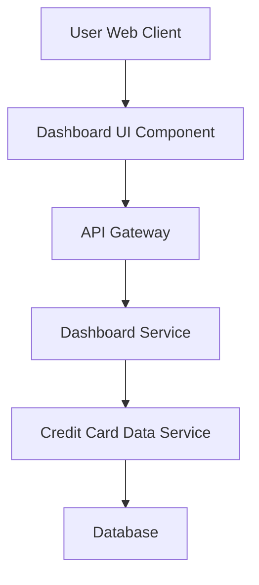

#### 1. High-Level Design

- **Summary**: This epic delivers a consolidated, responsive dashboard that displays key credit card portfolio metrics including monthly spend, total credit limit, available credit, and outstanding amounts. The dashboard provides real-time visibility into financial health across all user credit cards through a modern web interface.

- **Component Flow**:

- **Integration Points**: 
  - **Upstream**: Credit Card Data Service (provides card balances, limits, and transaction data)
  - **Downstream**: None specified in epic

- **Key Assumptions**: 
  - Real-time/near real-time refresh implies polling or WebSocket mechanism (frequency not specified, assume 30-60 second intervals)
  - KPI calculations (monthly spend, available credit) are computed by the Credit Card Data Service or Dashboard Service

- **NFR Highlights**: Dashboard must be responsive across desktop, tablet, and mobile devices; KPI data refresh must occur in real-time or near real-time; Interface must support modern web browsers

- **Data Flow**: User accesses the dashboard through a web client. The Dashboard UI Component requests KPI data via the API Gateway, which routes the request to the Dashboard Service. The Dashboard Service queries the Credit Card Data Service to retrieve aggregated card balances, credit limits, transaction totals, and outstanding amounts from the Database. The computed KPIs (Monthly Spend, Total Credit Limit, Available Credit, Outstanding Amount) are returned through the API Gateway and rendered on the responsive dashboard interface with real-time or near real-time updates.

#### 2. Validation Report

- **Requirements Coverage**: The design fully covers the epic's stated scope including dashboard interface, all four KPIs (Monthly Spend, Total Credit Limit, Available Credit, Outstanding Amount), responsive layout, and integration with the credit card data service. The component flow addresses the NFRs for responsiveness, real-time data refresh, and modern browser support. The architecture supports the consolidation of multiple credit cards as specified in the user value statement.