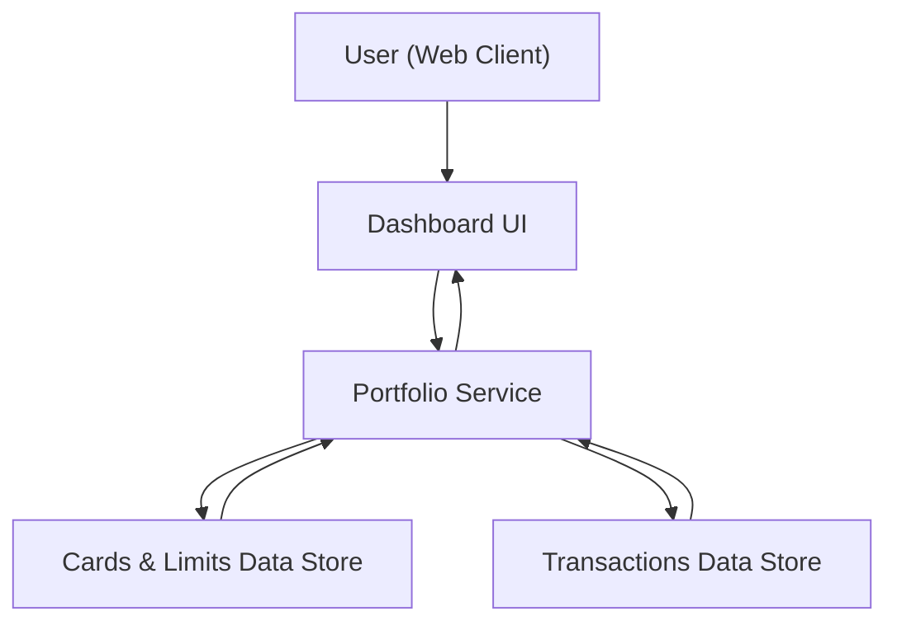

#### 1. High-Level Design
- Summary: Deliver a consolidated, responsive dashboard that presents key credit card portfolio metrics (monthly spend, total credit limit, available credit, outstanding amount) across all cards, enabling users to monitor overall credit exposure and usage from a single interface.

- Component Flow:

- Integration Points:
  - Internal cards and limits data source or mock data repository to provide total credit limit, available credit, and outstanding amounts.
  - Internal transactions data source or mock dataset to derive monthly spend KPIs.

- Key Assumptions:
  - Card and transaction data are sourced from internal or mock data stores refreshed on a scheduled basis (e.g., daily) rather than real-time bank integrations.
  - All monetary values are stored and processed in a single, consistent currency per user profile.

- NFR Highlights:
  - Dashboard KPIs must render with modern, responsive UI latency while supporting multiple cards per user and ensuring basic data privacy (no unnecessary exposure of detailed card identifiers).

- Data Flow:
  - Inputs: User accesses the dashboard via the web client; portfolio service retrieves card-level limits, available credit, and outstanding amounts from the cards and limits data store, and monthly transaction aggregates from the transactions data store.
  - Processing: Portfolio service aggregates card data across all cards, calculates KPIs (monthly spend, total credit limit, available credit, outstanding amount), and prepares a unified portfolio view.
  - Outputs: Dashboard UI presents consolidated KPIs and portfolio metrics in a responsive layout for web and mobile, updating views when the user changes filters or card selections.

#### 2. Validation Report
- Requirements Coverage: The high-level design covers the epic’s stated scope by providing a responsive dashboard landing view, supporting multiple credit cards in a single portfolio, and surfacing the required KPIs (monthly spend, total credit limit, available credit, outstanding amount) derived from internal cards and transactions data sources.