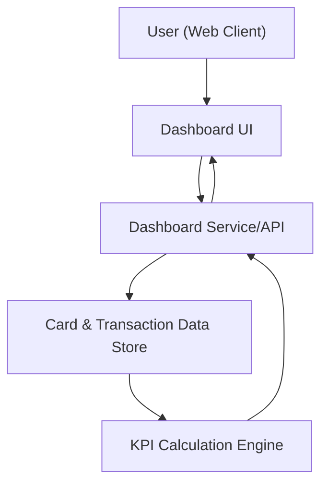

#### 1. High-Level Design
- Summary: Deliver a modern, responsive dashboard that consolidates all credit cards into a single interface and surfaces core KPIs (monthly spend, total credit limit, available credit, outstanding amount) for one or multiple cards in a unified view.
- Component Flow:

- Integration Points: 
  - Internal card and transaction data sources or mock data services providing card metadata and transaction histories.
  - Data pipelines that supply consolidated card and transaction data used for KPI computation.
- Key Assumptions:
  - Card and transaction data is exposed via secure internal APIs or data services with a stable schema (card identifiers, limits, balances, and transaction amounts/dates).
  - KPI refresh occurs on a near-real-time or scheduled basis aligned with available transaction ingestion frequency.
- NFR Highlights: System UI must be responsive across common device sizes and KPI calculations should update quickly based on underlying transaction data to ensure a smooth user experience.
- Data Flow: 
  - Inputs: The Dashboard UI initiates requests to the Dashboard Service/API with user context and selected card set. The service retrieves card and transaction records from the Card & Transaction Data Store, passes them to the KPI Calculation Engine to compute monthly spend, total credit limit, available credit, and outstanding amounts. 
  - Processing: KPI Calculation Engine aggregates transaction data per card and across cards, applies business rules to derive KPIs, and returns computed values to the Dashboard Service/API.
  - Outputs: Dashboard Service/API sends consolidated card list, KPI values, and summary view data back to the Dashboard UI, which renders a responsive, multi-card overview and KPIs for user consumption.

#### 2. Validation Report
- Requirements Coverage: The described design covers the epic’s scope by providing a consolidated, responsive dashboard UI, integrating with card and transaction data sources, computing and exposing the specified KPIs (monthly spend, total credit limit, available credit, available credit, outstanding amount), and supporting multi-card overview in a single interface.