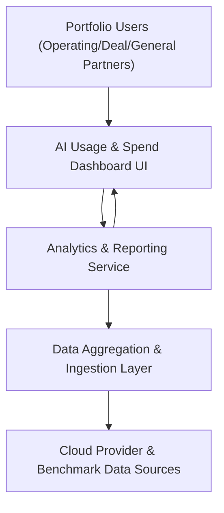

#### 1. High-Level Design

- Summary: Deliver a cloud-based, portfolio-wide AI usage and spend dashboard that aggregates, visualizes, and analyzes AI technology data across all portfolio companies, providing real-time insights, benchmarking, drill-down analytics, reports, and AI-driven cost optimization insights.

- Component Flow:

- Integration Points:
  - Secure API integrations with AWS AI, Azure AI, and GCP AI services for AI usage and spend data.
  - Data sources for industry benchmarks (for cross-company and industry-average comparisons).
  - Existing SSO provider for user authentication (for secure access to the dashboard).

- Key Assumptions:
  - Portfolio companies have enabled and configured access to their cloud AI usage and billing data via supported cloud provider APIs.
  - Industry benchmark data is available in a consumable format (e.g., API or curated dataset) aligned with the dashboard’s data model and update cadence.

- NFR Highlights: Dashboard pages must load within 3 seconds for 95% of interactions, support up to 200 portfolio companies and 1,000 concurrent users, encrypt all data in transit and at rest, enforce RBAC with audit logging, comply with WCAG 2.1 AA, and achieve 99.5% uptime with automated failover and daily backups.

- Data Flow:
  - Inputs: AI usage and spend data from AWS, Azure, and GCP AI services; benchmark data; portfolio configuration (companies, mappings, user-role assignments).
  - Processing: The Data Aggregation & Ingestion Layer periodically ingests and normalizes data from cloud providers and benchmark sources; the Analytics & Reporting Service computes portfolio- and company-level metrics, benchmarks, trends, cost optimization analytics, and simulation scenarios; data freshness indicators and stale-data flags are calculated.
  - Outputs: The Dashboard UI presents portfolio-level dashboards, company-level drill-down views, benchmarking visualizations, data freshness indicators, configurable widgets and personalized views, reports (PDF/Excel), executive summaries, and AI-driven cost optimization recommendations to authenticated users based on their roles.

#### 2. Validation Report

- Requirements Coverage: To be validated based on PRD and test cases.
- Design Review Status: Pending formal architecture and security review.
- Risks & Open Questions:
  - Availability and consistency of benchmark data across all industries represented in the portfolio.
  - Variability in cloud provider billing metrics and taxonomy alignment.
- Next Steps:
  - Finalize data model and mapping rules.
  - Implement proof-of-concept with a subset of portfolio companies.
  - Conduct performance, security, and usability testing prior to production rollout.
