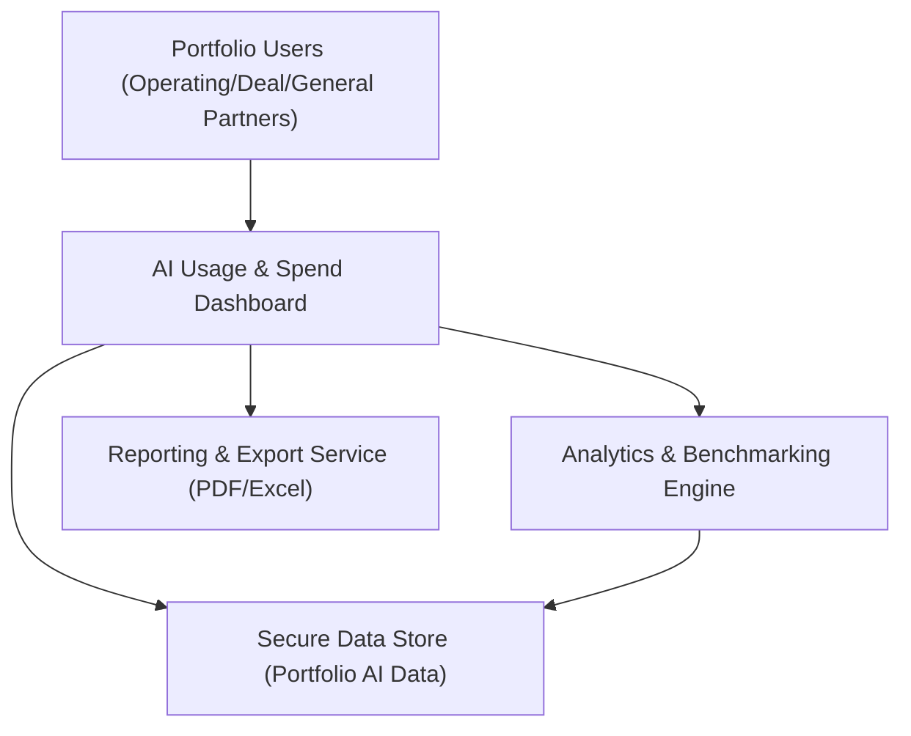

#### 1. High-Level Design
- Summary: Deliver a consolidated, real-time dashboard of AI usage and spend across all portfolio companies, with drill-down analytics, benchmarking, executive summaries, and exportable reports to support portfolio-wide transparency and decision-making.

- Component Flow:

- Integration Points:
  - Consumes AI usage and spend data aggregated from cloud providers (AWS, Azure, GCP) via the integrations/data pipelines defined in related epics.
  - Integrates with reporting/export mechanisms to generate PDF and Excel outputs for stakeholders.
  - Relies on data freshness indicators and pipeline outputs to reflect up-to-date portfolio data.

- Key Assumptions:
  - Data provided to the dashboard is already normalized per company, department, and project by upstream data pipelines.
  - User authentication and role-based access (e.g., which companies a user can see) are handled by the security/Access Control epic.

- NFR Highlights:
  - Dashboard pages must load within 3 seconds for 95% of interactions, support up to 200 portfolio companies and 1,000 concurrent users, encrypt all data with TLS 1.2+/AES-256, achieve 99.5% uptime with failover/backups, and meet WCAG 2.1 AA accessibility.

- Data Flow:
  - Upstream integrations ingest and normalize AI usage and spend data into the secure data store, tagged by company/department/project.
  - The dashboard queries this store to render consolidated views, drill-down details, benchmarking comparisons, and executive summaries.
  - The analytics engine computes benchmarks and pre-/post-investment metrics and surfaces data freshness indicators.
  - The reporting service generates PDF/Excel exports based on the currently visible dashboard data, ensuring performance and security constraints are met.

#### 2. Validation Report
- Requirements Coverage: The design covers the core scope: consolidated portfolio-level AI usage visualization, real-time spend views, drill-down analytics, benchmarking, data freshness indicators, executive summaries, and report exports, aligned with specified performance, scalability, security, reliability, and accessibility NFRs.
