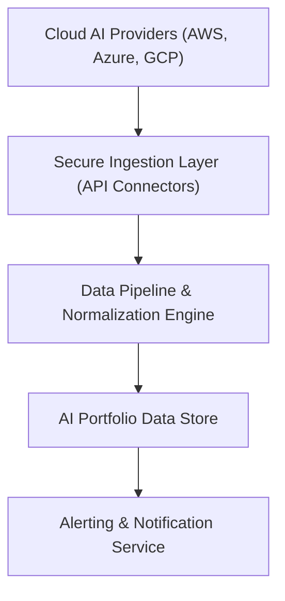

#### 1. High-Level Design
- Summary: Implement secure, automated ingestion of AI usage and spend data from major cloud providers (AWS, Azure, GCP), normalize it across portfolio companies, enforce data freshness, and deliver configurable alerts for budget threshold breaches and data quality issues, including scenario simulation and AI-driven cost optimization recommendations.

- Component Flow:

- Integration Points:
  - Integrates securely with AWS, Azure, and GCP AI services via APIs for usage and spend data.
  - Connects to portfolio companies’ cloud accounts/configurations for data access and permissions.
  - Relies on SSO/identity provider for secure service access, and system monitoring/logging for pipeline health and audit trails.
  - Feeds normalized data and alert events to the portfolio dashboard and reporting features in the visibility/analytics epic.

- Key Assumptions:
  - Portfolio companies will provide and maintain necessary API credentials/permissions to access AI usage and spend metrics.
  - Alert delivery mechanisms (e.g., email, in-app notifications) are available through an existing or shared notification framework.

- NFR Highlights:
  - Data must be no older than 24 hours, budget alerts must be delivered within 5 minutes of data sync, exports must complete within 10 seconds, all data flows must be encrypted with TLS 1.2+/AES-256, and pipelines must meet 3-second dashboard load performance and 99.5% uptime.

- Data Flow:
  - Cloud AI providers expose usage/spend metrics via secure APIs to the ingestion layer.
  - The data pipeline pulls, transforms, and normalizes this data across portfolio companies into the AI portfolio data store, enforcing data freshness rules.
  - Budget thresholds and data quality rules run against stored data; breaches or stale/missing data trigger events in the alerting service.
  - Alerts and indicators propagate to the dashboard, reports, and possibly email/in-app notifications, while scenario simulation and AI-driven recommendations read from the same normalized data store.

#### 2. Validation Report
- Requirements Coverage: The design addresses secure API-based ingestion from major cloud providers, automated aggregation/normalization, configurable budget thresholds, alerts for budget and data freshness, data freshness indicators, scenario simulation, and AI-driven cost optimization, aligned with the specified performance, encryption, and availability constraints.
