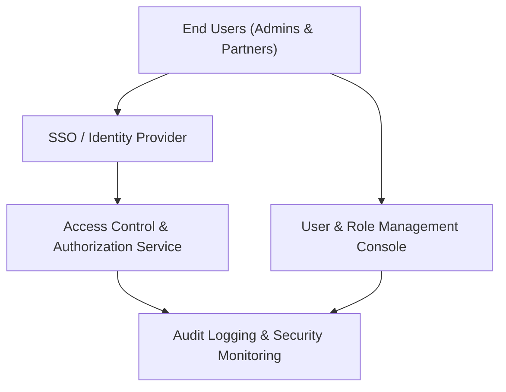

#### 1. High-Level Design
- Summary: Provide secure, role-based access control, authentication and authorization via existing SSO, comprehensive user and role management for Enterprise Admins, audit logging of access attempts, and user lockout recovery capabilities to protect portfolio data privacy and compliance while minimizing friction.

- Component Flow:

- Integration Points:
  - Integrates with existing SSO/identity providers for user authentication.
  - Uses portfolio firms’ user directories where applicable for federated identity and access mapping.
  - Relies on cloud provider IAM and permissions for integration setup and secure access to portfolio data.
  - Connects to central logging and monitoring systems for audit logs and security events.

- Key Assumptions:
  - SSO and identity provider already support required protocols (e.g., SAML/OIDC) and can surface user attributes needed for role mapping.
  - The dashboard and backend services consistently call the access control service for authorization checks on company-level data.

- NFR Highlights:
  - All data access must be encrypted with TLS 1.2+ and AES-256, role-based access control and audit logging are mandatory for all user actions, the system must support up to 1,000 concurrent users without degrading auth performance, meet WCAG 2.1 AA for admin/user flows, and deliver lockout recovery emails within 2 minutes.

- Data Flow:
  - Users authenticate via SSO; the identity provider issues tokens/assertions consumed by the access control service.
  - The access control service evaluates roles and company-level permissions, and mediates access to dashboard data and admin functions.
  - Enterprise Admins use the user/role management console to configure roles, assign users to companies, and manage lockout recovery, with changes persisted and enforced by the authorization layer.
  - All significant access and admin actions are written to central audit logs and security monitoring systems for compliance and incident response.

#### 2. Validation Report
- Requirements Coverage: The design spans role-based access by user/company, user and role management, SSO-based authentication, access restriction to assigned company data, audit logging of unauthorized attempts and key events, lockout handling and recovery, weekly admin access reviews, and alignment with portfolio-wide security policies, consistent with the specified security, concurrency, accessibility, and lockout recovery NFRs.
