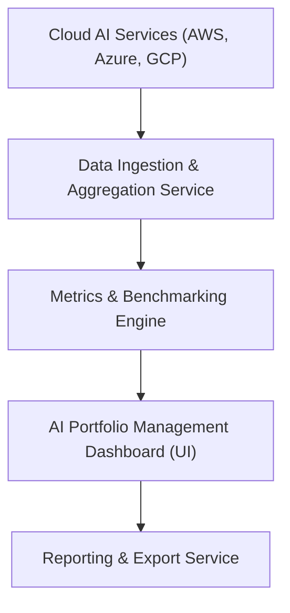

#### 1. High-Level Design
- Summary: Aggregate AI usage and spend data from major cloud AI providers into a unified, interactive dashboard that supports real-time views, benchmarking, drill-down analytics, data freshness indicators, executive summaries, and report/export capabilities for portfolio-wide AI oversight.
- Component Flow:

- Integration Points: APIs and data access from AWS, Azure, and GCP AI services; existing SSO solution for authentication; portfolio companies’ cloud configurations enabling integrations and data sharing; reliance on cloud provider API stability and versioning.
- Key Assumptions:
  - Portfolio companies configure and maintain their cloud credentials and scopes through a secure onboarding process prior to aggregation.
  - Benchmarking uses standardized metrics (e.g., spend, usage volume, adoption scores) and reference industry averages supplied from curated datasets or internal benchmarks.
- NFR Highlights: Dashboard loads within 3 seconds for 95% of interactions with up to 50 portfolio companies; supports up to 200 portfolio companies and 1,000 concurrent users; all data encrypted in transit and at rest (TLS 1.2+, AES-256); 99.5% uptime with failover and daily backups; WCAG 2.1 AA accessibility.
- Data Flow: Cloud AI service data is pulled or received by the Data Ingestion & Aggregation Service, normalized and stored as portfolio-wide metrics. The Metrics & Benchmarking Engine computes company-level and portfolio-level metrics, cross-company and industry benchmarks, and drill-down analytics. The AI Portfolio Management Dashboard presents consolidated and detailed views, data freshness indicators, and executive summaries, while the Reporting & Export Service generates comparative reports and enables PDF/Excel exports.

#### 2. Validation Report
- Requirements Coverage: The design covers secure multi-cloud data ingestion, automated aggregation, real-time consolidated views, benchmarking, drill-down analytics, freshness indicators, executive summaries, comparative reporting, exports, and the specified performance, scalability, security, uptime, and accessibility requirements.
