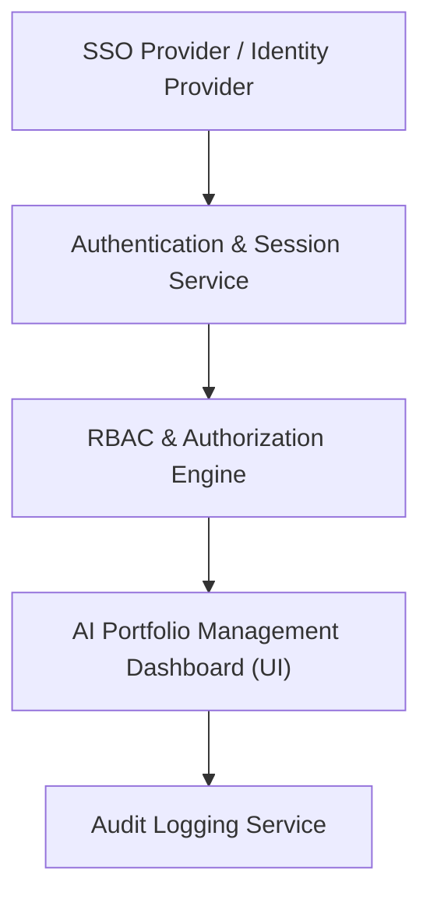

#### 1. High-Level Design
- Summary: Implement robust role-based access control, SSO-based authentication, user management, audit logging, and security governance for the AI Portfolio Management Dashboard to ensure only authorized stakeholders access sensitive portfolio data.
- Component Flow:

- Integration Points: Existing SSO provider for authentication; internal identity and access management policies; cloud provider security and permissions models that govern access to portfolio data.
- Key Assumptions:
  - Roles (e.g., Enterprise Admin, Operating Partner, Deal Partner) and company-level access mappings are defined centrally and stored in a secure RBAC configuration store.
  - Audit logs are persisted in a secure, immutable logging repository accessible to security and compliance teams for periodic review.
- NFR Highlights: Mandatory encryption of data in transit and at rest (TLS 1.2+, AES-256); RBAC and audit logging required; support for up to 1,000 concurrent users with maintained access control integrity; 99.5% uptime; WCAG 2.1 AA accessibility.
- Data Flow: Users authenticate via the SSO Provider, and the Authentication & Session Service establishes a session. The RBAC & Authorization Engine evaluates user roles and company-level permissions for each UI request, ensuring only authorized data is returned. All access attempts (including unauthorized attempts and lockout events) are recorded by the Audit Logging Service, which generates logs for security governance and compliance review.

#### 2. Validation Report
- Requirements Coverage: The design addresses RBAC configuration, permission assignment and revocation, restricted data views, audit logging of unauthorized access, user lockout handling, SSO integration, and access log review, while meeting encryption, scalability, uptime, and accessibility constraints.
