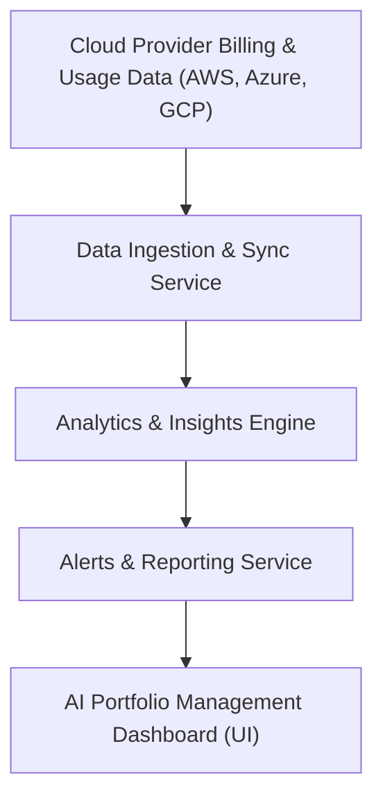

#### 1. High-Level Design
- Summary: Provide configurable alerts, reporting, and AI-driven insights on AI portfolio cost and usage, enabling Operating and Deal Partners to proactively manage spend and optimize vendor and usage decisions.
- Component Flow:

- Integration Points: Cloud provider billing and usage APIs (AWS, Azure, GCP); portfolio company configuration interfaces for budget thresholds and data sharing; existing SSO solution for authenticated access; internal reporting workflows for board/investor communication.
- Key Assumptions:
  - Budget thresholds and alert preferences are maintained per portfolio company via a configuration interface controlled by Enterprise or Operating Partners.
  - Alerts are primarily delivered via email and in-dashboard notifications, aligned with existing firm communication channels.
- NFR Highlights: Alerts delivered within 5 minutes of threshold breach after data sync; reports generated within 10 seconds; dashboards and reporting load within 3 seconds for 95% of requests; 99.5% uptime; all data encrypted in transit and at rest (TLS 1.2+, AES-256); WCAG 2.1 AA accessibility.
- Data Flow: Cloud billing and usage data is ingested by the Data Ingestion & Sync Service, normalized, and passed to the Analytics & Insights Engine, which evaluates cost, usage patterns, thresholds, and simulations. The Alerts & Reporting Service then generates budget threshold alerts, freshness warnings, benchmarking views, and exportable reports, exposing them via the AI Portfolio Management Dashboard for Operating and Deal Partners.

#### 2. Validation Report
- Requirements Coverage: The design covers alert configuration and delivery, reporting and export capabilities, benchmarking, AI-driven recommendations, scenario simulation, and the stated performance/security/accessibility NFRs, aligned with integrations to cloud providers and SSO.
