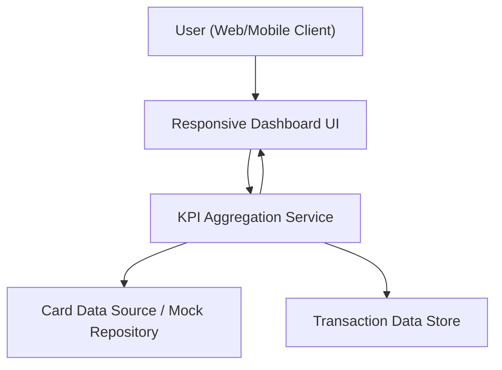

#### 1. High-Level Design
- Summary: Deliver a modern, responsive dashboard that provides a unified view of all credit cards, showing monthly spend, total credit limit, available credit, and outstanding balances through KPI tiles and summary components.

- Component Flow:

- Integration Points:
  - Internal card data source or mock repository supplying card limits, available credit, and basic card attributes.
  - Internal transaction data store providing data needed to compute monthly spend and outstanding amounts.
  - KPI aggregation service deriving dashboard KPIs from card and transaction data for presentation in the responsive UI.

- Key Assumptions:
  - Dashboard consumes already-available internal card and transaction data (or mocks) without integrating directly with external bank systems.
  - KPI computations (monthly spend, total credit limit, available credit, outstanding amount) are refreshed at a defined cadence that is “near-real-time” relative to the underlying transaction data updates.

- NFR Highlights: Dashboard must render within acceptable UX performance thresholds on modern browsers and mobile devices; KPI values should update with near-real-time accuracy while ensuring secure viewing of financial summaries without exposing actual bank integration credentials.

- Data Flow: The user accesses the responsive dashboard UI from web or mobile. The UI calls the KPI aggregation service to request consolidated KPIs. The aggregation service retrieves card attributes (limits, balances) from the card data source and transaction information from the transaction store, calculates monthly spend, total credit limit, available credit, and outstanding amounts, and returns summarized KPI data to the dashboard UI, which displays multiple card summary tiles and KPI widgets.

#### 2. Validation Report
- Requirements Coverage: The design provides a responsive dashboard layout with multiple card summaries and KPIs for monthly spend, total credit limit, available credit, and outstanding amount, using internal card and transaction data sources and a KPI aggregation service, fully aligned with the epic’s described scope, NFRs, dependencies, and out-of-scope constraints.
