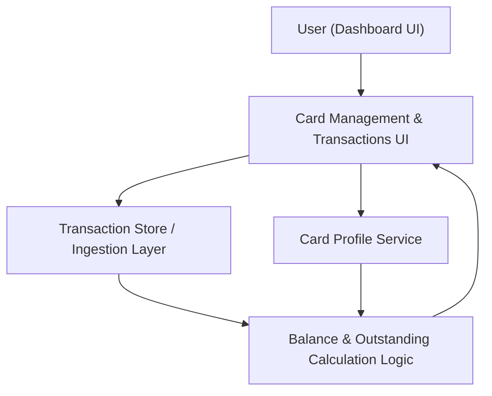

#### 1. High-Level Design
- Summary: Enable users to monitor multiple credit cards and their associated transactions from a single interface, providing consolidated card profiles and transaction listings as a foundation for spend tracking and financial insights.

- Component Flow:

- Integration Points:
  - Internal card catalog or profile service providing card identifiers, limits, and basic attributes.
  - Internal transaction store or ingestion mechanism supplying card transactions with basic attributes (date, amount, category).
  - Internal logic or service to derive outstanding balances from transaction data and card configurations.

- Key Assumptions:
  - Card and transaction data are already ingested and normalized into internal services; no direct real-time bank connectivity is required.
  - Transaction metadata is limited to non-sensitive attributes (e.g., no full card numbers), suitable for secure dashboard display.

- NFR Highlights: System must handle multiple cards per user without noticeable dashboard performance degradation; transaction retrieval and aggregation complete within reasonable time for typical consumer volumes, following secure handling practices for financial transaction metadata.

- Data Flow: The user opens the dashboard UI and navigates to the multi-card view. The UI calls the card profile service to retrieve card profiles and the transaction store to fetch associated transactions per card. Balance and outstanding calculation logic uses data from the card service and transaction store to compute derived metrics (e.g., outstanding amounts), which are returned to the UI to display card-wise transaction lists and summaries.

#### 2. Validation Report
- Requirements Coverage: The design covers multiple card profiles, card-wise transaction listing, basic transaction attributes, linkage between cards and transactions, and computation of outstanding balances, in line with the epic’s scope and non-functional requirements, while staying within the defined out-of-scope boundaries.
