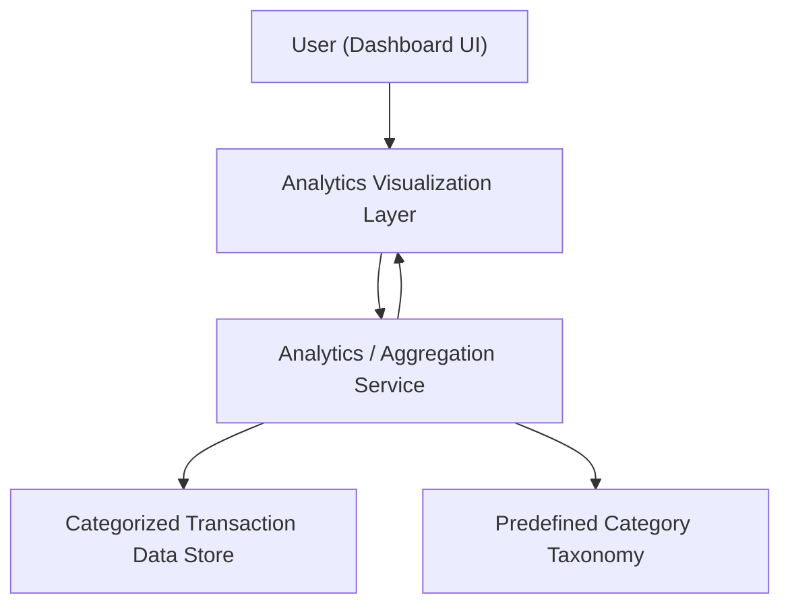

#### 1. High-Level Design
- Summary: Provide analytical views and interactive visualizations for monthly spend trends, card-wise spend analysis, and category-wise spending across predefined categories such as Food & Dining, Fuel, Shopping, Travel, Entertainment, Utilities, Healthcare, Education, and Miscellaneous.

- Component Flow:

- Integration Points: 
  - Categorized transaction data store providing transaction records with category tags.
  - Internal analytics/aggregation layer computing monthly trends, card-wise totals, and category-wise sums.
  - Visualization framework/component library used by the dashboard UI to render charts.

- Key Assumptions:
  - Transaction categories follow a predefined taxonomy and are already assigned in the transaction store.
  - Analytics computations run on summarized/aggregated data batches (e.g., nightly or near real-time) rather than per-request raw processing.

- NFR Highlights: Analytics visualizations must render quickly for typical consumer transaction volumes, with optimized aggregation by month, card, and category without exposing sensitive raw financial data beyond what is necessary for summarized insights.

- Data Flow: User interacts with the dashboard UI, which requests analytical views from the visualization layer. The visualization layer calls the analytics/aggregation service, which retrieves categorized transactions and category definitions from the transaction data store and taxonomy, computes monthly trends and category totals, and returns aggregated metrics and series data to the visualization layer, which renders charts for the user.

#### 2. Validation Report
- Requirements Coverage: The design addresses monthly spend trends, card-wise spend analysis, and category-wise spending analytics using a dedicated analytics service, predefined category taxonomy, and visualization layer, aligning with the epic scope and respecting the stated NFRs and dependencies.
