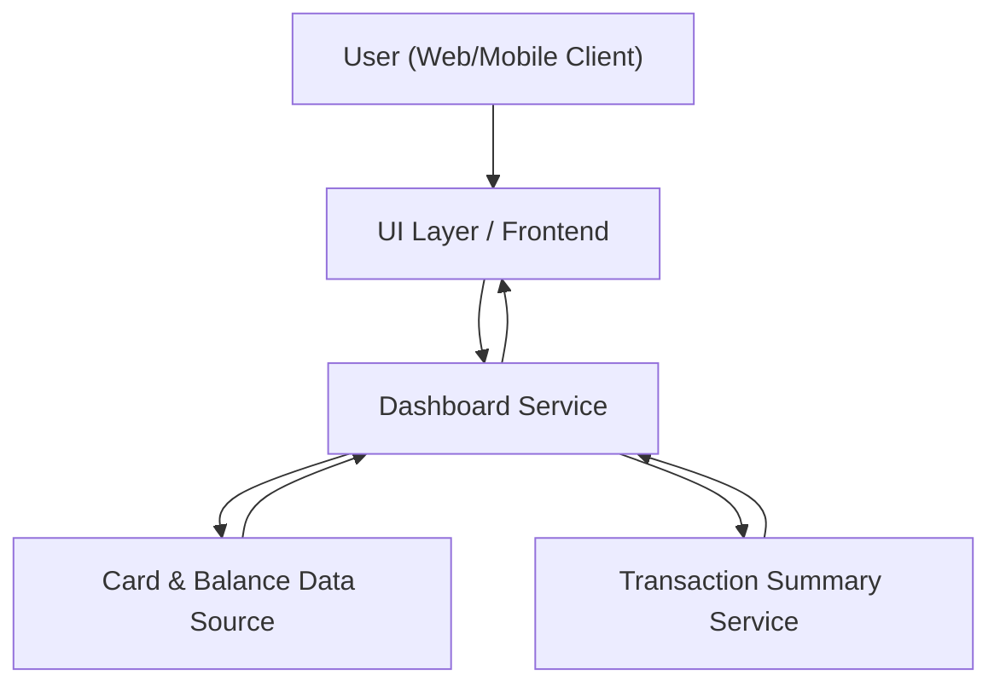

#### 1. High-Level Design
- Summary: Deliver a modern, responsive dashboard that consolidates key information across all user credit cards (monthly spend, total credit limit, available credit, outstanding amounts) into a single, at-a-glance view to help users understand overall credit exposure and spending status.

- Component Flow:

- Integration Points:
  - Internal data sources or services providing:
    - Card limits and balances
    - Transaction summaries for monthly spend KPIs
  - Internal user profile or card management modules for card listing

- Key Assumptions:
  - Card, balance, and transaction summary data is exposed via authenticated internal APIs with consistent identifiers per user and card.
  - KPI aggregations (monthly spend, total limit, available credit, outstanding amount) are calculated from pre-aggregated or efficiently queryable data, not raw transaction streams.

- NFR Highlights:
  - Dashboard KPIs must render with minimal latency and support a responsive UI across desktop, tablet, and mobile while handling multiple cards without performance degradation.

- Data Flow:
  - The user accesses the dashboard via the frontend UI, which calls the Dashboard Service with the authenticated user context.
  - The Dashboard Service fetches card listing and card-level data (limits, balances, outstanding amounts) from the Card & Balance Data Source, and monthly spend / KPI summaries from the Transaction Summary Service.
  - The Dashboard Service aggregates these values into consolidated KPIs (e.g., total credit limit, overall available credit, total outstanding amount, monthly spend across cards).
  - The aggregated KPI payload is returned to the frontend, which renders the unified dashboard view and adapts layout responsively based on device/screen size.

#### 2. Validation Report
- Requirements Coverage: The described design covers the epic’s stated scope by providing a unified dashboard layout that displays multiple credit cards, key KPIs (monthly spend, total credit limit, available credit, outstanding amounts), uses internal card and transaction data sources, and meets the responsiveness and performance NFRs for multi-card scenarios.