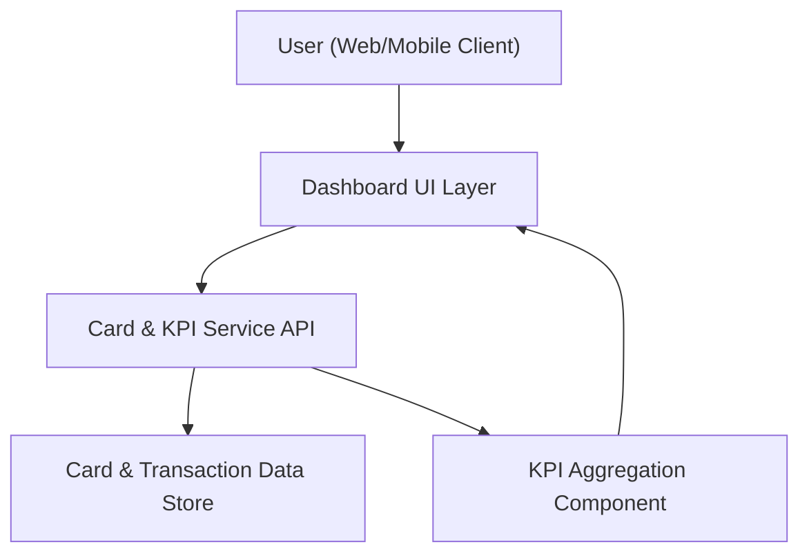

#### 1. High-Level Design
- Summary: Deliver a modern, responsive dashboard that consolidates all user credit cards into a single interface, showing key KPIs (monthly spend, total credit limit, available credit, outstanding amounts) across cards to provide an at-a-glance view of overall credit exposure and usage.

- Component Flow:

- Integration Points:
  - Internal card and transaction data sources or mock services providing card details, limits, balances, and transaction summaries.
  - Internal KPI aggregation logic that computes monthly spend, total credit limit, available credit, and outstanding amounts from card and transaction data.

- Key Assumptions:
  - Card and transaction data are exposed via secure internal APIs or mock services with consistent schemas (e.g., card_id, limit, balance, transactions with date/amount).
  - KPIs are calculated over a configurable but consistent time window (e.g., current calendar month) and refreshed on demand or at a reasonable interval.

- NFR Highlights:
  - Dashboard KPIs must render within acceptable UX latency for interactive use, with responsive layouts across common desktop and mobile resolutions while avoiding exposure of sensitive identifiers.

- Data Flow:
  - The user accesses the dashboard via a web or mobile client, which calls the Dashboard UI layer.
  - The Dashboard UI invokes the Card & KPI Service API to retrieve card details and transaction summaries from the Card & Transaction Data Store.
  - The KPI Aggregation Component processes the raw card and transaction data to compute monthly spend, total credit limit, available credit, available credit, and outstanding amounts across all cards.
  - Aggregated KPI results are returned to the Dashboard UI, which renders the consolidated multi-card view and KPIs for the user.

#### 2. Validation Report
- Requirements Coverage: The design covers the epic’s stated scope by providing a unified multi-card dashboard, key KPIs (monthly spend, total credit limit, available credit, outstanding amounts), and a responsive UI backed by internal card/transaction data and KPI aggregation logic, aligned with the consolidation and visibility objectives described in the epic.