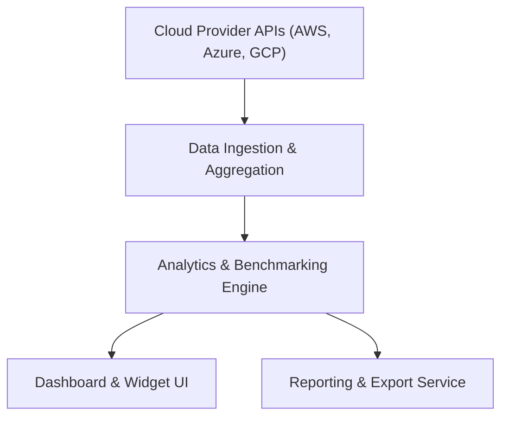

#### 1. High-Level Design
- Summary: Provide a cloud-based dashboard aggregating AI usage and spend data across portfolio companies, with real-time visibility, drill-down analytics, benchmarking, and reporting/export capabilities.
- Component Flow:

- Integration Points: Secure APIs to AWS/Azure/GCP AI services; SSO provider for authentication; synthetic performance monitoring; data freshness and logging systems.
- Key Assumptions:
  - Company- and department-level drill-down is driven by metadata from aggregated usage/spend data.
  - Benchmarking uses configurable baselines and stored industry averages maintained in the analytics engine.
- NFR Highlights: Dashboard loads within 3s for 95% of interactions; supports up to 200 companies and 1,000 concurrent users; TLS 1.2+/AES-256 encryption; WCAG 2.1 AA; uptime ≥99.5%; data freshness ≤24 hours.

#### 2. Validation Report
- Requirements Coverage: The architecture supports aggregation, visualization, drill-down, benchmarking, customization, exports, and freshness guarantees, meeting the epic’s described scope and NFRs.
