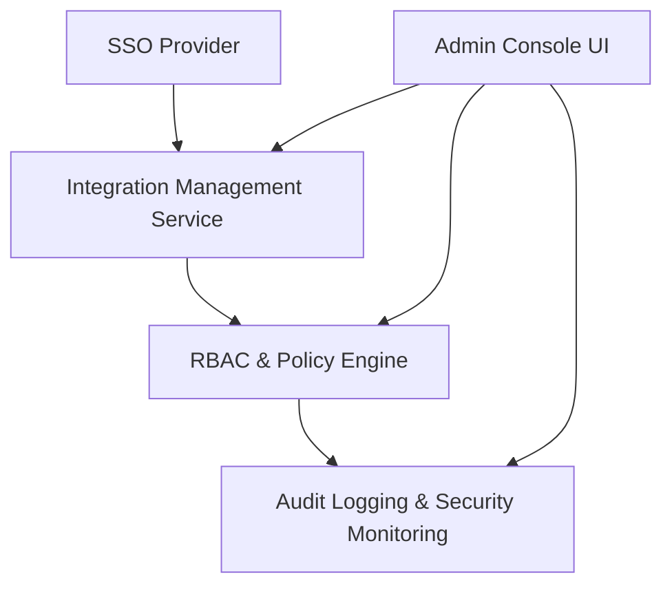

#### 1. High-Level Design
- Summary: Deliver integration management and role-based access control so Enterprise Admins can securely configure connections to AI platforms, manage permissions, enforce security policies, and support access recovery.
- Component Flow:

- Integration Points: AWS/Azure/GCP APIs; enterprise SSO provider; portfolio companies’ cloud accounts; internal email/notification infrastructure; security monitoring tools.
- Key Assumptions:
  - Admin console is the primary interface for configuring integrations and managing access.
  - RBAC enforces company-level data boundaries across all dashboard views and APIs.
- NFR Highlights: Full audit logging; TLS 1.2+ encryption; RBAC under up to 1,000 concurrent users; SSO aligned with 99.5% uptime; access recovery within defined SLAs.

#### 2. Validation Report
- Requirements Coverage: The design addresses integration setup, secure data collection, RBAC, audit logging, alerts, lockout detection, and recovery, aligning closely with the epic’s functional and non-functional requirements.
