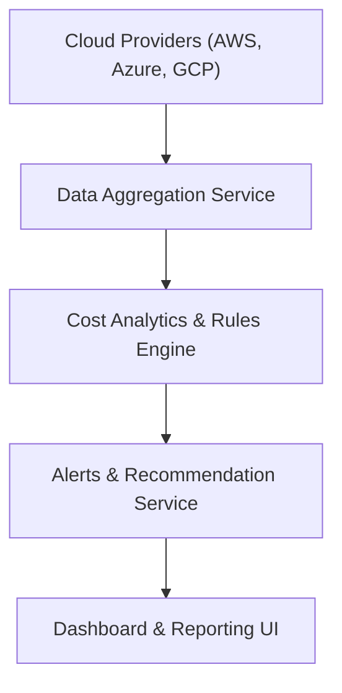

#### 1. High-Level Design
- Summary: Provide budget threshold alerts, AI-driven cost optimization recommendations, and scenario simulations so partners can monitor AI spend, respond to overspend, and explore savings options.
- Component Flow:

- Integration Points: Data aggregation services with AWS/Azure/GCP; internal rules/analytics engine; dashboard/reporting modules; monitoring/logging systems.
- Key Assumptions:
  - Budget thresholds and scenarios are configured per company within the dashboard UI.
  - Recommendations are generated from already-ingested usage/spend data and do not modify provider billing settings.
- NFR Highlights: Must generate alerts within 5 minutes of data sync; recommendations and simulations under ~3s for 95% of requests; scale to 200 companies; data freshness ≤24 hours; encrypted and RBAC-controlled.

#### 2. Validation Report
- Requirements Coverage: The design explicitly supports configurable thresholds, alerting, recommendations, scenario simulation, and reporting while honoring described NFRs and dependencies, covering the epic scope well.
