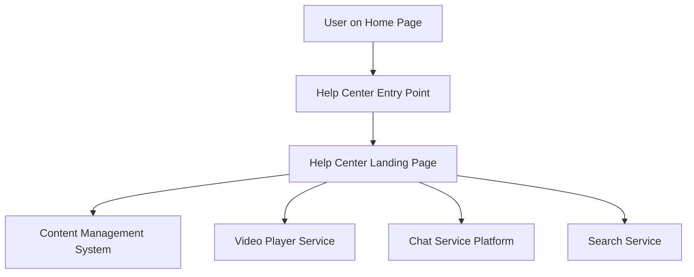

#### 1. High-Level Design

- **Summary**: Enhance the existing website by introducing a clearly visible Help Center entry point on the Home Page. The Help Center will provide users with multiple self-service support options, including textual help content, video tutorials, downloadable help materials, and an interactive chat function. The objective is to make product guidance and support easily accessible from the Home Page without requiring users to search across multiple pages or external sources.

- **Component Flow**:

- **Integration Points**: 
  - Existing Home Page infrastructure (integration point for Help Center entry)
  - Video player service for embedded tutorials
  - Chat service or Help Assistant platform
  - Content management system for help articles and materials
  - Search service for help content indexing

- **Key Assumptions**: 
  - Help Center content (articles, FAQs, videos, downloadable materials) is already available or will be provided by content teams
  - Existing authentication system will be leveraged for user context in chat and personalized help

- **NFR Highlights**: Must maintain existing Home Page performance and load times; Must be responsive across desktop, tablet, and mobile devices; Must follow existing application branding and accessibility standards; Search functionality must return relevant results within acceptable response times

- **Data Flow**: User navigates to Home Page → clicks Help Center entry point → routed to Help Center Landing Page → user selects help option (articles, videos, chat, downloadables) → request sent to respective backend service (CMS for articles, Video Player Service for videos, Chat Service for interactive help, Search Service for keyword queries) → content retrieved and rendered responsively → user consumes help content to resolve issues or learn product features.

#### 2. Validation Report

- **Requirements Coverage**: The design covers all stated scope elements including Help Center entry point on Home Page, dedicated landing page, categorized content organization, text-based articles/FAQs, embedded video tutorials, interactive chat assistant, downloadable materials, and search functionality. All integration points (Home Page infrastructure, video player, chat service, CMS, search service) are identified. NFRs for responsiveness, performance, branding, and accessibility are acknowledged. Out-of-scope items (live agent support, community forums, user-generated content, multi-language support, ticketing integration) are explicitly excluded as specified.