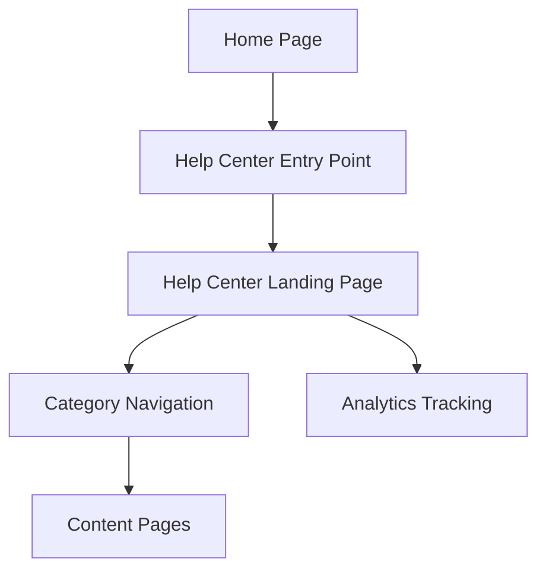

#### 1. High-Level Design

- **Summary**: This epic establishes the foundational Help Center infrastructure with a prominent entry point from the Home Page and a dedicated landing page organizing content into 8 logical categories (Getting Started, FAQs, How-to Guides, Video Tutorials, Help Materials, Troubleshooting, Chat Support, Search Help). The solution is fully responsive across all devices, maintains brand consistency, meets WCAG 2.1 AA accessibility standards, loads within 2 seconds on broadband (5 seconds on mobile), scales to 10,000 concurrent users, and maintains 99.9% uptime.

- **Component Flow**:

- **Integration Points**: 
  - Existing website tech stack for frontend integration
  - Web analytics tracking system for measuring Help Center access rates
  - Branding and accessibility guidelines compliance
  - Existing Home Page infrastructure (preserving current functionality)

- **Key Assumptions**: 
  - Help content for all 8 categories is available or being developed in parallel
  - Existing website infrastructure supports horizontal scaling to meet concurrent user requirements

- **NFR Highlights**: Page load within 2 seconds (broadband) / 5 seconds (mobile), support for 10,000 concurrent users with horizontal scalability, 99.9% uptime with automated monitoring, WCAG 2.1 AA accessibility compliance, HTTPS for all content

- **Data Flow**: User lands on Home Page → Clicks Help Center entry point in main navigation → Request routed to Help Center Landing Page → Landing page loads within 2 seconds (broadband) displaying 8 content categories → User selects category (Getting Started, FAQs, How-to Guides, Video Tutorials, Help Materials, Troubleshooting, Chat Support, or Search Help) → Category-specific content page loads → User browses content → Analytics tracking captures access patterns and device information → If resource unavailable: meaningful error message displayed → User can navigate back or select different category → All interactions served over HTTPS with accessibility features enabled (keyboard navigation, screen reader support)

#### 2. Validation Report

- **Requirements Coverage**: The design fully addresses all requirements including prominent Help Center entry point on Home Page, dedicated landing page with 8 categorized content sections, responsive design across desktop/tablet/mobile, brand consistency, WCAG 2.1 AA accessibility compliance, performance targets (2-second broadband, 5-second mobile load times), scalability to 10,000 concurrent users, 99.9% uptime, meaningful error messages, and preservation of existing Home Page functionality. The architecture establishes the foundation for self-service support.

- **Traceability**: Each requirement maps to specific components:
  - Help Center access → Entry Point + Landing Page
  - Content organization → Category Navigation (8 categories)
  - Responsive design → Frontend responsive implementation
  - Accessibility → WCAG 2.1 AA implementation across all components
  - Performance → Optimized page load + CDN delivery
  - Scalability/uptime → Horizontal scaling infrastructure + monitoring

- **Gaps & Risks**: 
  - Content availability for all 8 categories not confirmed; may impact launch readiness
  - Integration approach with existing Home Page navigation requires detailed technical design to avoid disruption
  - Automated monitoring system for 99.9% uptime not specified; needs implementation plan
  - Accessibility testing and validation process not detailed
  - Mobile network performance optimization strategies (5-second target) require further specification