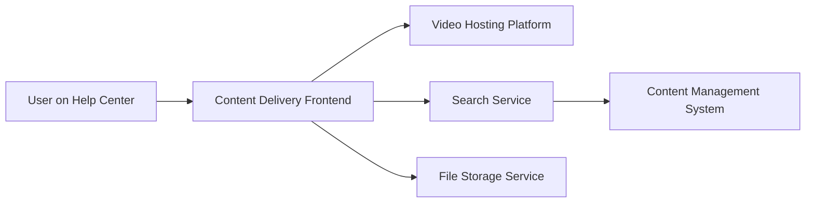

#### 1. High-Level Design

- **Summary**: This epic delivers multi-format help content including embedded video tutorials with playback controls, downloadable materials (PDF, DOCX), and unified keyword-based search across all content types. Video playback must start within 2 seconds with cross-device compatibility and graceful error handling. Search results must return within 2 seconds, indexing articles, videos, and downloadable materials. All content is served securely over HTTPS with GDPR compliance and support for 10,000 concurrent users.

- **Component Flow**:

- **Integration Points**: 
  - Video hosting and embedding platform for tutorial delivery
  - Content management system for help materials organization
  - Search indexing service for cross-content search
  - Secure file storage and delivery system for downloadable materials
  - Existing website tech stack for frontend integration

- **Key Assumptions**: 
  - Video content is pre-encoded in formats compatible with standard HTML5 players
  - Search indexing is performed offline/batch; real-time indexing of new content not required initially

- **NFR Highlights**: Video playback within 2 seconds, search results within 2 seconds, HTTPS for all content delivery, GDPR compliance, support for 10,000 concurrent users, cross-device video player compatibility

- **Data Flow**: User navigates to Help Center content section → Frontend requests content from CMS → For video tutorials: embedded player loads from video hosting platform → Video streams to user with playback controls → For downloadable materials: user clicks download → File retrieved from secure storage service via HTTPS → File downloaded to user device → For search: user enters keywords → Search service queries indexed content (articles, videos, materials) → Results returned within 2 seconds with filtering options → User selects result → Corresponding content loaded (video, article, or download initiated) → All interactions logged for analytics

#### 2. Validation Report

- **Requirements Coverage**: The design comprehensively covers all stated requirements including embedded video tutorials with 2-second playback initiation, downloadable materials in PDF/DOCX formats, keyword-based search across all content types with 2-second response time, cross-device video compatibility, graceful error handling, and secure HTTPS delivery with GDPR compliance. The component architecture clearly separates video hosting, search functionality, and file storage to optimize performance and scalability.

- **Traceability**: Each requirement maps to specific components:
  - Video tutorials → Video Hosting Platform + Content Delivery Frontend
  - Downloadable materials → File Storage Service + Content Delivery Frontend
  - Search functionality → Search Service + Content Management System
  - Cross-device compatibility → Frontend responsive design + HTML5 video standards
  - Security/compliance → HTTPS delivery + GDPR-compliant storage

- **Gaps & Risks**: 
  - Video hosting platform selection and integration complexity not detailed
  - Search indexing strategy and refresh frequency not specified; may impact search result relevance
  - Error handling for failed media loads requires detailed UX design
  - Content migration from existing systems to new CMS not addressed
  - Video encoding standards and bandwidth optimization strategies not specified