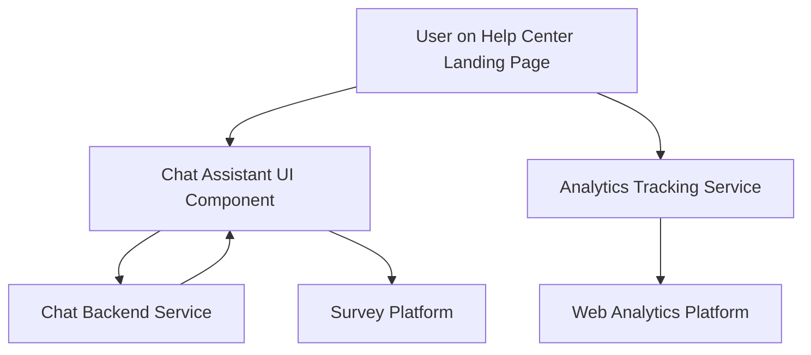

#### 1. High-Level Design

- **Summary**: This epic delivers an interactive chat assistant integrated into the Help Center landing page, providing real-time support with sub-2-second load times. It includes comprehensive user analytics tracking Help Center access rates, mobile usage patterns, device analytics, and post-interaction satisfaction surveys. The solution must scale to 10,000 concurrent users, comply with GDPR, serve all interactions over HTTPS, and maintain 99.9% uptime.

- **Component Flow**:

- **Integration Points**: 
  - Third-party or custom chat assistant solution (GDPR-compliant)
  - Web analytics platform for user interaction and device tracking
  - Survey platform for post-interaction feedback collection
  - Automated monitoring system for uptime tracking
  - Privacy policy and compliance framework

- **Key Assumptions**: 
  - Chat messages are text-based only (no file attachments or rich media in initial release)
  - Analytics data is processed asynchronously and does not block user interactions

- **NFR Highlights**: Chat assistant must open within 2 seconds, scale to 10,000 concurrent users, serve over HTTPS with GDPR compliance, and maintain 99.9% uptime; analytics tracking must not impact 2-second page load target

- **Data Flow**: User accesses Help Center landing page → Chat UI component loads within 2 seconds → User sends message through chat interface → Message transmitted via HTTPS to chat backend service → Backend processes and returns response in real-time → Simultaneously, analytics service captures user interactions (page access, device type, mobile usage) → Data sent to web analytics platform → Post-interaction survey triggered → Survey responses collected by survey platform → All data aggregated for continuous improvement analysis

#### 2. Validation Report

- **Requirements Coverage**: The design addresses all core requirements including real-time chat functionality with 2-second load time, scalability to 10,000 concurrent users, GDPR compliance, HTTPS security, comprehensive analytics tracking (access rates, mobile usage, device analytics), and post-interaction surveys. The component flow clearly separates chat functionality from analytics tracking to ensure performance targets are met. Integration points are identified for all external dependencies including chat solution, analytics platform, survey platform, and monitoring systems.

- **Traceability**: Each requirement maps to specific components:
  - Real-time chat → Chat Assistant UI + Chat Backend Service
  - User analytics → Analytics Tracking Service + Web Analytics Platform
  - Satisfaction surveys → Survey Platform integration
  - GDPR compliance → Privacy framework integration across all components
  - Performance/scalability → Infrastructure design supporting concurrent users

- **Gaps & Risks**: 
  - Third-party chat solution selection not yet finalized; vendor evaluation needed
  - Analytics tracking implementation must be carefully designed to avoid impacting page load performance
  - GDPR compliance requires detailed data retention and user consent mechanisms not fully specified
  - Uptime monitoring and alerting mechanisms need detailed implementation planning