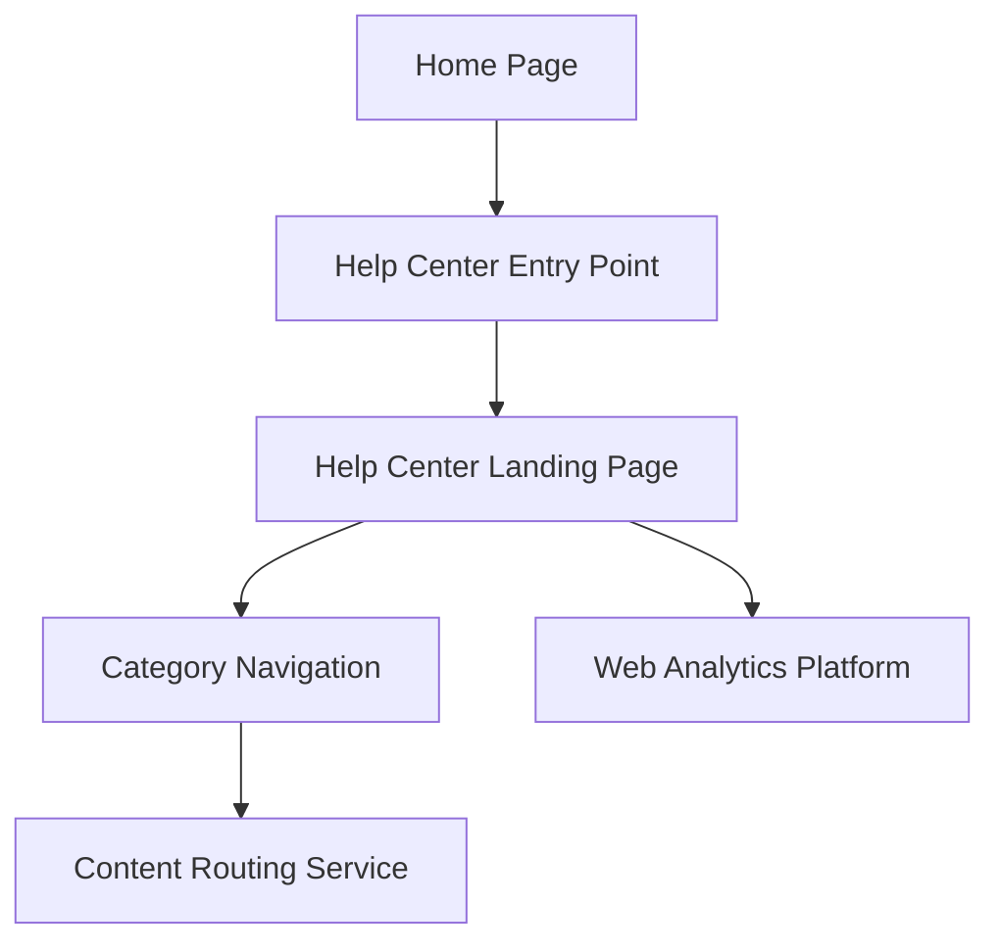

#### 1. High-Level Design

- **Summary**: This epic establishes a centralized Help Center accessible from the Home Page with a dedicated landing page featuring categorized help content (Getting Started, FAQs, How-to Guides, Video Tutorials, Help Materials, Troubleshooting, Chat Support, Search Help). The implementation must load within 2 seconds (broadband) / 5 seconds (mobile), support 10,000 concurrent users, maintain 99.9% uptime, meet WCAG 2.1 AA accessibility standards, and integrate seamlessly with existing Home Page without disruption.

- **Component Flow**:

- **Integration Points**:
  - Existing Home Page layout and navigation system for entry point integration
  - Existing website tech stack for compatibility
  - Web analytics platform for tracking user interactions and navigation patterns
  - Branding and accessibility guidelines for visual consistency
  - Backend content routing service for category-based navigation

- **Key Assumptions**:
  - The Help Center entry point will be added as a prominent navigation element (e.g., header link or button) without requiring major Home Page redesign
  - Category structure is predefined with eight categories; content organization follows existing taxonomy

- **NFR Highlights**: Pages load within 2 seconds (broadband) / 5 seconds (mobile); support 10,000 concurrent users with horizontal scalability; 99.9% uptime; WCAG 2.1 AA accessibility (keyboard navigation, screen reader support); HTTPS delivery

- **Data Flow**: User visits Home Page → Clicks Help Center entry point → Help Center landing page loads within 2 seconds displaying eight categorized sections → User selects category (e.g., Getting Started, FAQs, Troubleshooting) → Content routing service directs to appropriate content section → Category content rendered responsively with visual branding consistency → Navigation tracked via web analytics → Error messages displayed with actionable steps if content unavailable → All interactions accessible via keyboard and screen readers per WCAG 2.1 AA

#### 2. Validation Report

- **Requirements Coverage**: The design fully covers all requirements including prominent Help Center entry point on Home Page, dedicated landing page with eight categorized sections, responsive design across desktop/tablet/mobile, visual branding alignment, WCAG 2.1 AA accessibility compliance (keyboard navigation and screen reader support), error handling with meaningful messages, seamless integration with existing Home Page, 2-second load time (broadband) / 5-second (mobile), 10,000 concurrent user support, 99.9% uptime, and HTTPS delivery. The architecture maintains existing Home Page functionality while adding centralized help access.