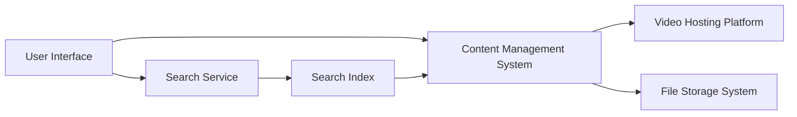

#### 1. High-Level Design

- **Summary**: This epic provides comprehensive help content delivery through multiple formats (text articles, FAQs, video tutorials, downloadable materials) with keyword-based search functionality. The system must return search results within 2 seconds, support 10,000 concurrent users, ensure video playback within 2 seconds, and deliver all content responsively across devices with HTTPS encryption.

- **Component Flow**:

- **Integration Points**:
  - Content Management System (CMS) for articles and FAQs
  - Video hosting/embedding platform for tutorial delivery
  - Search indexing service for cross-content search capability
  - File storage system for downloadable materials (PDF, DOCX)
  - CDN for content delivery optimization

- **Key Assumptions**:
  - Help content (articles, videos, downloadable materials) is pre-created and available for integration
  - Search indexing will be performed asynchronously with near-real-time updates when new content is added

- **NFR Highlights**: Content load within 2 seconds (broadband) / 5 seconds (mobile); video playback within 2 seconds; search results within 2 seconds; support 10,000 concurrent users; HTTPS delivery; cross-device video compatibility

- **Data Flow**: User navigates to Help Center → Browses categories or enters search query → Search service queries indexed content across articles, videos, and downloadables → Results returned within 2 seconds with filtering options → User selects content type (article/video/download) → CMS retrieves text content, video platform streams embedded video, or file storage serves downloadable material over HTTPS → Content rendered responsively on user's device → Error messages displayed if resources unavailable

#### 2. Validation Report

- **Requirements Coverage**: The design addresses all requirements including multi-format content delivery (text, video, downloadable materials), keyword-based search with 2-second response time, embedded video players with playback controls, downloadable materials in PDF/DOCX formats, error handling with meaningful messages, responsive design across devices, and HTTPS content delivery. The architecture supports 10,000 concurrent users and maintains performance SLAs.