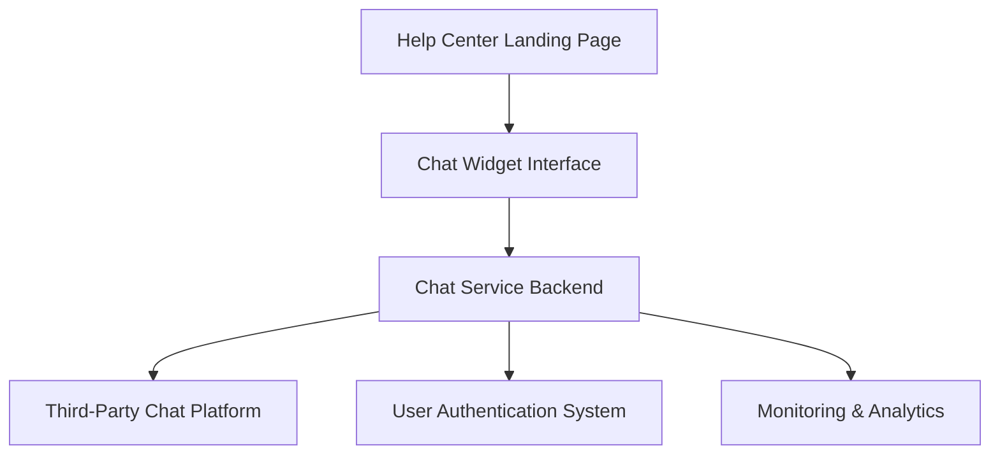

#### 1. High-Level Design

- **Summary**: This epic delivers an interactive chat assistant integrated into the Help Center landing page, providing real-time support for users with urgent issues. The solution must open within 2 seconds, support 10,000 concurrent users, maintain 99.9% uptime, and ensure GDPR compliance with HTTPS encryption for all chat interactions.

- **Component Flow**:

- **Integration Points**: 
  - Third-party chat assistant platform (or custom chat solution)
  - User authentication system for session management
  - Automated monitoring and alerting system for performance tracking
  - Existing website tech stack for seamless embedding
  - Privacy and security compliance frameworks (GDPR)

- **Key Assumptions**: 
  - Chat messages are not persisted beyond the active session; session-based storage only
  - A third-party SaaS chat platform will be selected that provides built-in GDPR compliance and horizontal scalability

- **NFR Highlights**: Chat window must open within 2 seconds; support 10,000 concurrent users with horizontal scalability; 99.9% uptime; HTTPS encryption; GDPR compliance for user data

- **Data Flow**: User clicks chat widget on Help Center landing page → Chat interface loads within 2 seconds → User sends message via chat widget → Message transmitted over HTTPS to chat service backend → Backend routes to third-party chat platform for processing → Response returned to user in real-time → All interactions monitored for performance and compliance → Session data cleared after chat ends (no persistence)

#### 2. Validation Report

- **Requirements Coverage**: The design covers all stated requirements including real-time messaging, 2-second load time, GDPR compliance, HTTPS encryption, scalability for 10,000 concurrent users, responsive functionality across devices, and performance monitoring. The architecture supports integration with third-party chat platforms while maintaining security and compliance standards.