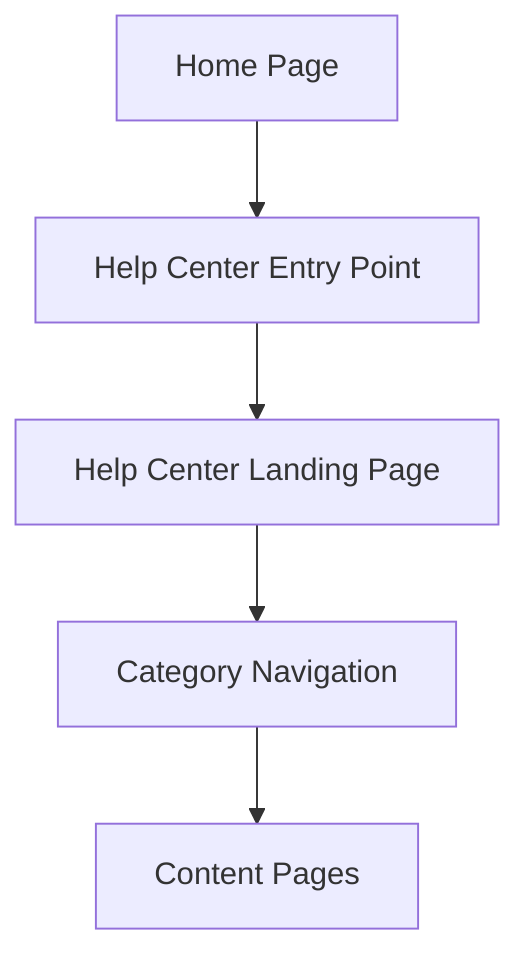

#### 1. High-Level Design

- **Summary**: This epic establishes the Help Center entry point on the Home Page and creates a dedicated landing page with organized categories (Getting Started, FAQs, How-to Guides, Video Tutorials, Help Materials, Troubleshooting, Chat Support, Search Help). The system provides responsive design across all devices, maintains brand consistency, ensures WCAG 2.1 AA accessibility, and aims to reduce support tickets by 20% through improved self-service access.

- **Component Flow**:

- **Integration Points**: 
  - Existing website tech stack and CMS for page rendering and content management
  - Existing website branding guidelines for visual consistency
  - Video hosting platform for video tutorial integration
  - Chat assistant technology provider for chat support access

- **Key Assumptions**: 
  - Help Center entry point will be added to Home Page header or prominent location without major layout redesign
  - Category structure will be implemented using existing CMS taxonomy and navigation patterns

- **NFR Highlights**: Page load <2 seconds on standard broadband; 10,000 concurrent users; 99.9% uptime; WCAG 2.1 AA accessibility (keyboard navigation, alt text, captions); HTTPS for all resources

- **Data Flow**: User visits Home Page → Clicks Help Center entry point → Redirected to Help Center landing page → Landing page loads from CMS with categorized navigation menu → User selects category (e.g., FAQs, Video Tutorials) → Navigation request sent to CMS → Appropriate content page rendered with category-specific resources → User browses content or uses search functionality → Error handling displays meaningful messages if resources unavailable → All interactions logged for analytics (covered in QE-5040).

#### 2. Validation Report

- **Requirements Coverage**: The design addresses all navigation and access requirements including Home Page entry point, dedicated landing page, eight content categories, responsive design, branding compliance, and accessibility standards. NFRs for performance (2-second load), scale (10K users), availability (99.9% uptime), accessibility (WCAG 2.1 AA), and security (HTTPS) are incorporated. Dependencies on existing CMS, branding guidelines, video platform, and chat technology are identified. The 20% support ticket reduction goal is supported through improved discoverability and organization of self-service resources.