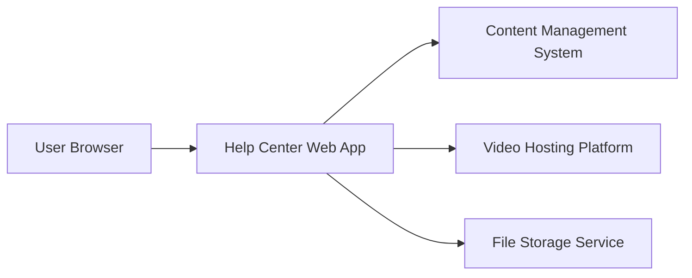

#### 1. High-Level Design

- **Summary**: This epic enables delivery of help content in multiple formats (text articles/FAQs, embedded video tutorials, downloadable materials) through the Help Center, with search and categorization capabilities. The system ensures fast content delivery (videos start within 3 seconds, pages load within 2 seconds), secure HTTPS delivery, and WCAG 2.1 AA accessibility compliance to support diverse learning preferences and achieve 60% self-service resolution.

- **Component Flow**:

- **Integration Points**: 
  - Video hosting platform integration for embedded video playback
  - Existing website CMS for content management and organization
  - Secure file storage and delivery system for downloadable materials
  - Content creation and maintenance by internal support team

- **Key Assumptions**: 
  - Video hosting will use an existing approved CDN-backed platform (e.g., YouTube, Vimeo, or internal streaming service)
  - Downloadable materials will be stored in existing cloud storage with CDN distribution for performance

- **NFR Highlights**: Video playback start <3 seconds; page load <2 seconds on standard broadband; 10,000 concurrent users; HTTPS for all content; WCAG 2.1 AA compliance (captions, alt text)

- **Data Flow**: User navigates to Help Center and selects content category → Request sent to web app → Web app queries CMS for text articles/FAQs → For videos, web app embeds player from video hosting platform → For downloads, web app retrieves secure links from file storage service → Content rendered in user browser with proper formatting and accessibility features → User consumes content (reads, watches, or downloads) → Search queries processed by CMS to return relevant results across all content types.

#### 2. Validation Report

- **Requirements Coverage**: The design covers all content format requirements (text, video, downloadable materials), search functionality, categorization, and secure delivery. NFRs for performance (video <3s, page load <2s), scale (10K users), security (HTTPS), and accessibility (WCAG 2.1 AA with captions and alt text) are addressed. Dependencies on video hosting, CMS, and file storage systems are identified. The 60% self-service resolution target is supported through comprehensive multi-format content availability.