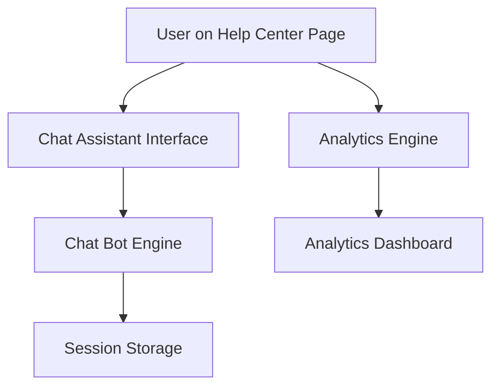

#### 1. High-Level Design

- **Summary**: This epic delivers an interactive chat assistant integrated into the Help Center landing page that provides automated support with sub-5-second response times, coupled with analytics capabilities to track user engagement metrics (topics accessed, downloads, searches) and optional feedback collection. The system ensures session-based data privacy and supports up to 10,000 concurrent users with 99.9% uptime.

- **Component Flow**:

- **Integration Points**: 
  - Chat assistant technology provider (third-party or internal bot platform)
  - Analytics and monitoring tools for metrics collection
  - Existing website tech stack for data collection and reporting
  - Internal support team systems for monitoring and content updates

- **Key Assumptions**: 
  - Chat assistant will use a third-party conversational AI platform with pre-built NLP capabilities
  - Analytics data will be aggregated in real-time and stored in existing data warehouse infrastructure

- **NFR Highlights**: Chat response time <5 seconds; 10,000 concurrent users; 99.9% uptime; HTTPS for all interactions; session-based data protection with opt-in for longer storage

- **Data Flow**: User initiates chat from Help Center → Chat interface sends query to bot engine → Bot engine processes query using NLP and knowledge base → Response returned to user within 5 seconds → Session data stored temporarily unless consent provided. Simultaneously, user interactions (page views, searches, downloads) are captured by analytics engine → Data aggregated and sent to analytics dashboard → Support staff access reports to identify trends and optimize content.

#### 2. Validation Report

- **Requirements Coverage**: The design addresses all core requirements including interactive chat with <5-second response, session-based privacy controls, analytics tracking for engagement metrics (topics, downloads, searches), and optional user feedback. NFRs for performance (10K concurrent users), security (HTTPS, data protection), and availability (99.9% uptime) are incorporated. Dependencies on chat technology provider and analytics tools are acknowledged.