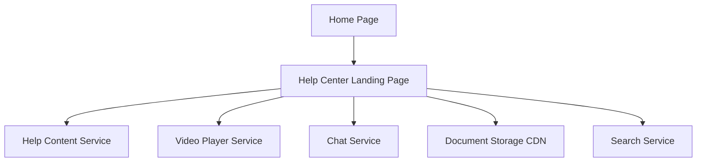

#### 1. High-Level Design

- **Summary**: Introduce a visible Help Center entry point on the Home Page providing access to self-service support resources including text articles, FAQs, video tutorials, downloadable materials, interactive chat, and search functionality. The solution must be responsive across all devices and maintain existing Home Page performance while following application branding and accessibility standards.

- **Component Flow**:

- **Integration Points**: 
  - Upstream: Existing Home Page infrastructure (navigation and UI framework)
  - Core: Video player/hosting service, chat service/chatbot platform, document storage/CDN
  - Lateral: Help Content Service, Search Service (from other epics)
  - Design must integrate seamlessly with existing branding, accessibility, and performance standards

- **Key Assumptions**: 
  - Existing Home Page infrastructure supports modular component integration without major refactoring
  - CDN for downloadable materials provides global distribution with acceptable latency

- **NFR Highlights**: Responsive across desktop/tablet/mobile; maintains existing Home Page performance and load times; follows existing branding and accessibility standards; search returns relevant results within acceptable response times

- **Data Flow**: User accesses Home Page → Help Center entry point visible in navigation → User clicks to access Help Center Landing Page → Landing Page loads categorized content from Help Content Service → User can view text articles, play videos via Video Player Service, download materials from Document Storage/CDN, initiate chat via Chat Service, or search via Search Service → All interactions maintain responsive design and performance standards across devices.

#### 2. Validation Report

- **Requirements Coverage**: The design covers all required elements: Help Center navigation on Home Page, landing page, categorized content, text articles/FAQs, embedded videos, interactive chat, downloadable materials, search functionality, and responsive design. NFRs for responsiveness, performance maintenance, branding/accessibility compliance, and search response times are addressed through component architecture and integration approach. All dependencies (Home Page infrastructure, video player/hosting, chat service/chatbot, document storage/CDN) are included. Out-of-scope items (live agent support, ticketing integration, community forums, multi-language support) are excluded as specified.