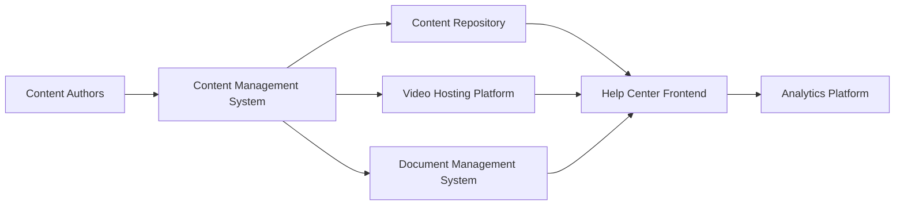

#### 1. High-Level Design

- **Summary**: Establish a comprehensive content management system to organize, author, publish, and maintain help resources across multiple formats (Getting Started guides, FAQs, How-to Guides, Video Tutorials, Help Materials, Troubleshooting docs). Content will be categorized, versioned, tagged with metadata for search optimization, and tracked via analytics.

- **Component Flow**:

- **Integration Points**: 
  - Core: Content Management System (CMS), video hosting platform, document management system
  - Downstream: Help Center frontend (content delivery), analytics platform (usage tracking)
  - Content flows from CMS to multiple storage systems and is delivered to users via Help Center

- **Key Assumptions**: 
  - CMS provides role-based access control for non-technical content authors
  - Content versioning supports rollback and audit trail without custom development

- **NFR Highlights**: Maintainable by non-technical staff; supports concurrent updates without downtime; optimized content delivery across all device types

- **Data Flow**: Content Authors create/update content in CMS → CMS stores structured content in Content Repository, videos in Video Hosting Platform, documents in Document Management System → Content is tagged with metadata and categorized → Help Center Frontend retrieves and delivers content to users → User interactions tracked by Analytics Platform for content optimization and usage insights.

#### 2. Validation Report

- **Requirements Coverage**: The design addresses all content types (Getting Started, FAQs, How-to Guides, Video Tutorials, Help Materials, Troubleshooting) through dedicated storage systems. Content authoring workflow, versioning, metadata tagging, and analytics are supported by the CMS and analytics platform. NFRs for non-technical maintainability, concurrent updates, and cross-device performance are met through CMS capabilities and content delivery optimization. All dependencies (CMS, video hosting, document management, analytics) are incorporated. Out-of-scope items (user-generated content, community contributions, automated generation, translation) are excluded.