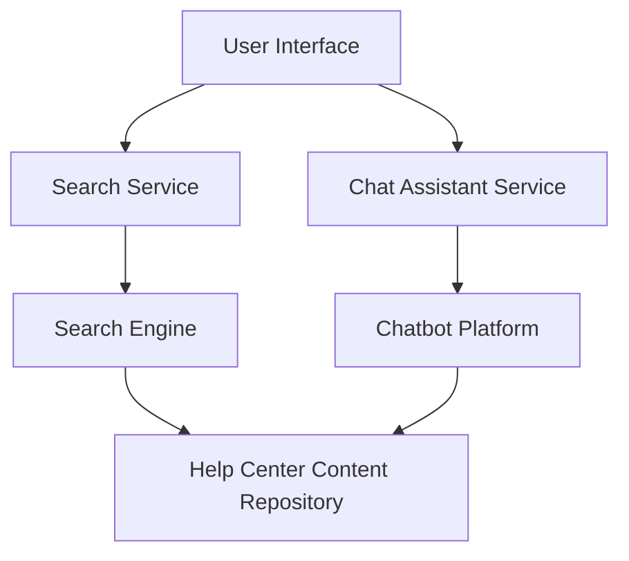

#### 1. High-Level Design

- **Summary**: Implement intelligent search functionality across all Help Center content and provide an interactive Chat/Help Assistant for real-time user support. The search will support keyword-based queries with ranking, relevance, filters, and handle misspellings/synonyms. The chat assistant will provide immediate guidance with conversation management and fallback messaging.

- **Component Flow**:

- **Integration Points**: 
  - Upstream: User session management system (for user context)
  - Core: Search engine/service, chatbot platform/API, Help Center content repository
  - Downstream: Search analytics platform (for optimization and tracking)

- **Key Assumptions**: 
  - Search engine supports fuzzy matching and synonym expansion out-of-the-box
  - Chat assistant will use rule-based or NLP-based responses without live agent escalation

- **NFR Highlights**: Search results within 2 seconds; Chat supports concurrent users without degradation; handles misspellings and synonyms; meaningful error messages for unavailable resources

- **Data Flow**: User submits search query → Search Service processes query through Search Engine → Search Engine queries Help Center Content Repository → Ranked results returned to User Interface within 2 seconds. For chat: User sends message → Chat Assistant Service routes to Chatbot Platform → Platform retrieves relevant content from Repository → Response delivered to User Interface with conversation context maintained.

#### 2. Validation Report

- **Requirements Coverage**: The design covers all stated requirements including keyword-based search with ranking/relevance, search filters, interactive chat interface, conversation management, fallback messaging, and analytics. The architecture supports the 2-second search response NFR and concurrent chat users. Integration with search engine, chatbot platform, content repository, and session management system addresses all dependencies. Out-of-scope items (voice search, AI/ML recommendations, external knowledge bases, live agent handoff) are explicitly excluded from the design.