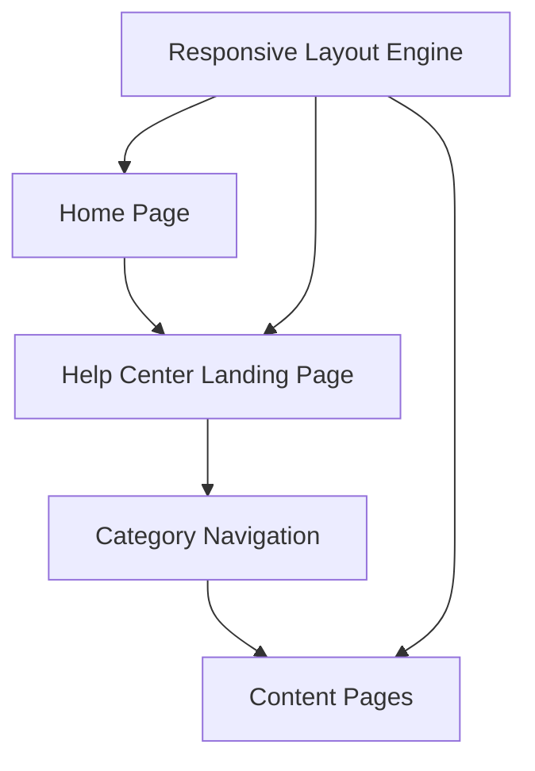

#### 1. High-Level Design

- **Summary**: This epic enables users to access a dedicated Help Center from the Home Page through a prominent navigation entry point. The Help Center landing page organizes content into logical categories (Getting Started, FAQs, How-to Guides, Video Tutorials, Help Materials, Troubleshooting, Chat Support, Search Help) with seamless navigation across topics. Implementation ensures existing Home Page functionality remains intact while adding responsive design support across all devices.

- **Component Flow**:

- **Integration Points**: 
  - Existing website branding and accessibility guidelines from design team
  - Web development resources for responsive design implementation
  - Documentation teams for existing help content and materials availability
  - Existing Home Page infrastructure to ensure preserved functionality

- **Key Assumptions**: 
  - Help Center will be implemented as a separate section/module that integrates with existing Home Page routing and navigation framework
  - Category organization will be configurable to allow future category additions without code changes

- **NFR Highlights**: Help Center pages must load within 2 seconds on all devices; Support 10,000 concurrent users; 99.9% uptime with automated monitoring; WCAG 2.1 AA accessibility compliance (keyboard navigation, screen reader support, color contrast); HTTPS for all content

- **Data Flow**: Users access the Home Page and click the Help Center entry point in the main navigation, which routes them to the Help Center Landing Page. The Responsive Layout Engine ensures optimal rendering across desktop, tablet, and mobile devices. Users interact with the Category Navigation component to browse organized content categories. Selecting a category or topic navigates to specific Content Pages. All pages maintain visual branding alignment with the existing website and comply with accessibility standards. Error messaging is displayed when resources are unavailable. The existing Home Page functionality remains fully operational throughout all interactions.

#### 2. Validation Report

- **Requirements Coverage**: The design covers all stated requirements including Help Center entry point on Home Page, dedicated landing page, categorized content organization across all specified categories (Getting Started, FAQs, How-to Guides, Video Tutorials, Help Materials, Troubleshooting, Chat Support, Search Help), responsive design across all devices, visual branding alignment, accessibility compliance (WCAG 2.1 AA), error messaging, and preservation of existing Home Page functionality. All integration points with design team guidelines, web development resources, and documentation teams are identified. The architecture supports the specified NFRs including 2-second page load, 10,000 concurrent users, 99.9% uptime, WCAG 2.1 AA accessibility standards, and HTTPS security.