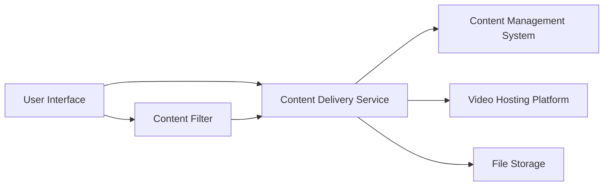

#### 1. High-Level Design

- **Summary**: This epic delivers comprehensive help content in multiple formats including text-based articles, FAQs, embedded video tutorials, and downloadable materials. Users can read articles directly, play videos across all devices, and download materials in standard formats (PDF, DOCX) for offline access. Implementation includes video player optimization, lazy-loading strategies, content filtering by category and popularity, and proper error handling.

- **Component Flow**:

- **Integration Points**: 
  - Content Management System for organizing and delivering help materials
  - Video hosting platform or embedded player solution for video tutorials
  - File storage and delivery infrastructure for downloadable materials
  - Support and documentation teams as content sources

- **Key Assumptions**: 
  - Video content will be hosted on a third-party CDN-backed platform supporting adaptive bitrate streaming
  - Downloadable files will be stored in cloud object storage with direct download links

- **NFR Highlights**: Video loading optimized to maintain 2-second page load target; Cross-device video compatibility; HTTPS for all downloads; Support 10,000 concurrent users; GDPR compliance for user data collection

- **Data Flow**: Users browse content through the UI, applying filters by category and popularity via the Content Filter component. The Content Delivery Service retrieves text-based articles and FAQs from the CMS, embeds video players that stream from the Video Hosting Platform using lazy-loading, and provides download links to files stored in File Storage. All content is served over HTTPS. When resources are unavailable, meaningful error messages are displayed. Video players are optimized to load asynchronously without blocking page rendering, maintaining the 2-second page load target.

#### 2. Validation Report

- **Requirements Coverage**: The design covers all stated requirements including text-based articles and FAQs, embedded video tutorials with cross-device compatibility, downloadable materials in standard formats (PDF, DOCX), video player optimization and lazy-loading, content filtering by category and popularity, and error handling for unavailable resources. All integration points with CMS, video hosting platform, file storage infrastructure, and content teams are identified. The architecture supports the specified NFRs including 2-second page load with video optimization, cross-device video compatibility, HTTPS for downloads, 10,000 concurrent users, and GDPR compliance.