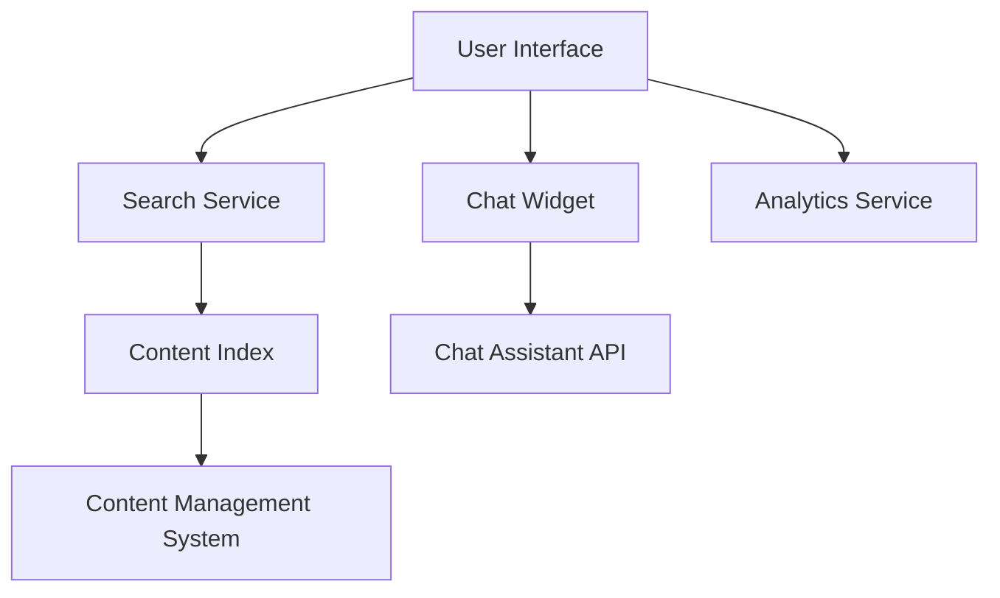

#### 1. High-Level Design

- **Summary**: This epic implements self-service capabilities through keyword-based search functionality indexing all Help Center content and an interactive chat assistant for real-time support. The search feature enables users to find relevant help content quickly with relevance ranking, while the chat assistant provides suggested help topics and complex question resolution with GDPR-compliant data protection over HTTPS.

- **Component Flow**:

- **Integration Points**: 
  - Third-party chat assistant vendor API for real-time chat functionality
  - Search indexing service for content indexing
  - Web analytics platform for usage tracking and monitoring
  - Content Management System for search content source
  - Support staff monitoring dashboard for chat interactions and analytics

- **Key Assumptions**: 
  - Search indexing will be performed asynchronously with near-real-time updates when content changes in the CMS
  - Chat assistant will use a REST or WebSocket API with standard authentication mechanisms

- **NFR Highlights**: Search results must return within 2 seconds; Chat widget must load within 3 seconds; HTTPS for all chat interactions; GDPR compliance for user data; Support 10,000 concurrent users; 99.9% uptime; WCAG 2.1 AA accessibility compliance

- **Data Flow**: Users enter search queries through the UI, which are sent to the Search Service that queries the Content Index (populated from the CMS) and returns ranked results within 2 seconds. For chat, users interact with the Chat Widget, which communicates with the Chat Assistant API via HTTPS, sending user messages and receiving responses in real-time. All interactions are logged to the Analytics Service for support staff monitoring, enabling identification of content gaps and common issues.

#### 2. Validation Report

- **Requirements Coverage**: The design covers all stated requirements including keyword-based search with relevance ranking, interactive chat assistant integration, real-time messaging, analytics and monitoring for support staff, fallback messaging, lazy-load optimization for chat widget, GDPR compliance, and performance targets. All integration points with third-party services, analytics platforms, and CMS are identified. The architecture supports the specified NFRs including 2-second search response, 3-second chat widget load, HTTPS security, 10,000 concurrent users, 99.9% uptime, and WCAG 2.1 AA accessibility.