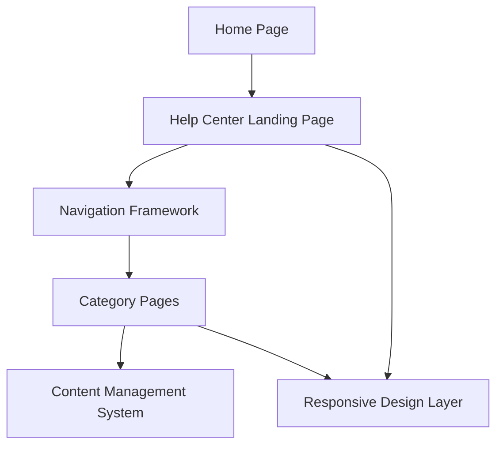

#### 1. High-Level Design

- **Summary:** This epic establishes a dedicated Help Center accessible from the Home Page with a prominent navigation entry point. The Help Center landing page organizes support resources into logical categories (Getting Started, FAQs, How-to Guides, Video Tutorials, Help Materials, Troubleshooting, Chat Support, Search Help), providing a centralized, intuitive interface for users to access product guidance and support resources.

- **Component Flow:**

- **Integration Points:**
  - Existing website design and navigation framework
  - Content management system for help articles
  - Video hosting platform for tutorials (referenced but content delivery handled separately)
  - Third-party chat assistant integration (referenced but chat functionality handled separately)

- **Key Assumptions:**
  - Navigation framework will integrate seamlessly with existing website architecture and maintain consistent branding
  - Category organization will be configurable through the CMS to allow future adjustments without code changes

- **NFR Highlights:** Page load < 2 seconds (95th percentile); support 100,000 monthly active users and 10,000 concurrent sessions; WCAG 2.1 AA compliance; 99.9% uptime; HTTPS delivery

- **Data Flow:** Users access the Home Page and click the Help Center entry point in the main navigation, which loads the Help Center Landing Page. The Navigation Framework renders the categorized structure (Getting Started, FAQs, How-to Guides, etc.) by retrieving category metadata from the CMS. When users select a category, the system loads the corresponding Category Page, which fetches and displays content from the CMS. The Responsive Design Layer ensures optimal rendering across desktop, tablet, and mobile devices. All pages are served over HTTPS with accessibility features enabled.

#### 2. Validation Report

- **Requirements Coverage:** The design fully addresses the epic's scope including Help Center entry point on Home Page, dedicated landing page, categorized content organization (8 categories specified), responsive design across all devices, branding and accessibility compliance, and navigation framework. All NFRs are covered: page load performance (< 2 seconds), scalability (100,000 MAU, 10,000 concurrent sessions), WCAG 2.1 AA accessibility standards, 99.9% uptime, and HTTPS delivery. Dependencies on existing website framework, CMS, video hosting, and chat integration are acknowledged and mapped to design components.