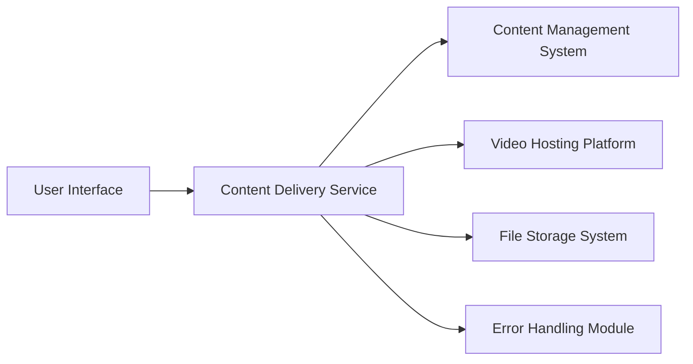

#### 1. High-Level Design

- **Summary:** This epic enables delivery of multi-format help content including text articles, FAQs, embedded video tutorials with playback controls, and downloadable materials (PDFs, DOC files). The system provides robust error handling with meaningful messages and alternative suggestions when resources are unavailable, ensuring seamless user experience across different content formats and access scenarios.

- **Component Flow:**

- **Integration Points:**
  - Content management system for help articles and FAQs
  - Video hosting platform for tutorials (supporting MP4 and WebM formats)
  - File storage and delivery system for downloadable materials (PDFs, DOC files)

- **Key Assumptions:**
  - Video hosting platform will provide embed codes or APIs for seamless integration with playback controls
  - File storage system will support HTTPS delivery with appropriate CDN capabilities for performance

- **NFR Highlights:** Video support for MP4/WebM formats; HTTPS delivery for all content; fully responsive and accessible across all devices; error messages within 2 seconds; GDPR compliance

- **Data Flow:** Users request help content through the UI, which routes requests to the Content Delivery Service. For text-based articles and FAQs, content is retrieved from the CMS. For video tutorials, the service fetches video metadata and embed information from the Video Hosting Platform, which streams content directly to users. For downloadable materials, the service retrieves files from the File Storage System and serves them over HTTPS. The Error Handling Module intercepts failed requests and generates meaningful error messages with alternative suggestions when resources are unavailable.

#### 2. Validation Report

- **Requirements Coverage:** The design comprehensively covers all scope elements including text articles/FAQs, embedded video tutorials with playback controls, downloadable materials in multiple formats (PDF, DOC), error handling with fallback messaging, and content preview/formatting. All NFRs are addressed: video format support (MP4, WebM), HTTPS delivery, responsive design, error message latency (< 2 seconds), and GDPR compliance. Dependencies on CMS, video hosting platform, and file storage system are mapped to corresponding architectural components.