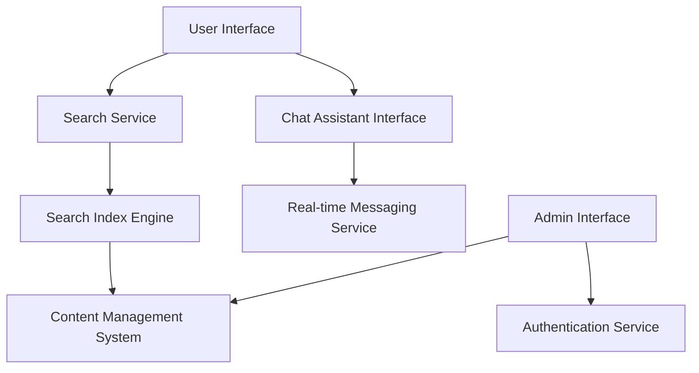

#### 1. High-Level Design

- **Summary:** This epic delivers interactive help capabilities through comprehensive search functionality and real-time chat assistance. Users can search across all Help Center content with keyword highlighting and previews, engage with an interactive chat assistant via modal or sidebar, and support staff can maintain FAQs and help articles through an admin interface.

- **Component Flow:**

- **Integration Points:**
  - Third-party chat assistant integration or custom chat solution
  - Search indexing service or engine (e.g., Elasticsearch, Solr)
  - Content management system for article updates
  - User authentication system for admin access and role-based access control

- **Key Assumptions:**
  - Search indexing will use a standard full-text search engine with real-time or near-real-time indexing capabilities
  - Chat assistant will maintain session state and message history for the duration of user sessions

- **NFR Highlights:** Search results < 1 second (95th percentile); 10,000 concurrent chat sessions; HTTPS with GDPR compliance; search index updates within 5 minutes; role-based admin access control

- **Data Flow:** Users submit search queries through the UI, which are processed by the Search Service against the Search Index Engine that continuously indexes content from the CMS. Search results with previews and keyword highlighting are returned to users. For chat interactions, users initiate conversations through the Chat Assistant Interface, which communicates with the Real-time Messaging Service to deliver responses. Support staff access the Admin Interface (authenticated via Authentication Service) to update FAQs and articles in the CMS, which triggers index updates.

#### 2. Validation Report

- **Requirements Coverage:** The design fully covers the epic's stated scope including search functionality with keyword indexing, search results with previews and highlighting, interactive chat assistant with modal/sidebar interface, real-time messaging, admin interface for content updates, and data protection compliance. All NFRs (performance, concurrency, security, indexing latency, access control) are addressed through appropriate architectural components. Dependencies on third-party chat integration, search engine, CMS, and authentication system are explicitly mapped to design components.