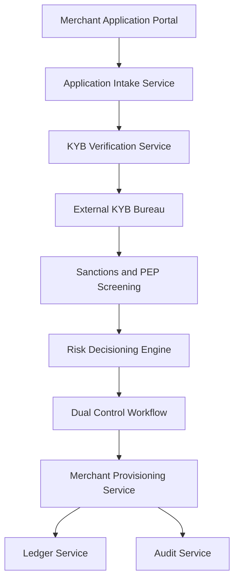

#### 1. High-Level Design

- **Summary:** This epic enables automated merchant onboarding with KYB verification, sanctions/PEP screening, risk decisioning, and merchant account provisioning. The system captures business identity, ownership, and settlement bank details, verifies business legitimacy through external KYB bureaus, screens against sanctions/PEP lists, produces approve/decline/refer decisions with dual control where required, and provisions merchant records with unique Merchant IDs and ledger accounts. The capability ensures fast, compliant onboarding while maintaining GDPR, AMLD, CTF, and SOX compliance.

- **Component Flow:**

- **Integration Points:**
  - **Upstream:** Enterprise IdP (OIDC authentication), external KYB bureau (business verification), sanctions and PEP list providers
  - **Downstream:** Ledger service (account creation), compliance service (risk decisioning), managed KMS and secrets store (PII encryption)

- **Key Assumptions:**
  - KYB bureau response time is within 5 seconds for synchronous verification; merchant application data is retained for 7 years per regulatory requirements.

- **NFR Highlights:** Enterprise IdP authentication via OIDC; PII encrypted at rest (AES-256) and in transit (TLS 1.3); GDPR legal basis and consent per Art. 6/7; immutable audit events; data residency region-pinned; SOX §404 dual-control validation; no live PAN in non-prod.

- **Data Flow:** Prospective merchants submit onboarding applications through the Merchant Application Portal, which authenticates users via Enterprise IdP (OIDC). The Application Intake Service captures business identity, ownership structure, and settlement bank details, classifying PII as Confidential/Restricted and encrypting it (AES-256 at rest, TLS 1.3 in transit). The KYB Verification Service calls the External KYB Bureau to verify business legitimacy (registration, tax ID, business address). Sanctions and PEP Screening checks ownership against sanctions and PEP lists. The Risk Decisioning Engine evaluates all verification results and produces approve/decline/refer decisions. High-risk or edge cases trigger the Dual Control Workflow, requiring secondary approval per SOX §404. Approved applications flow to the Merchant Provisioning Service, which creates merchant records with unique Merchant IDs and calls the Ledger Service to create ledger accounts. The Audit Service records all state transitions as immutable audit events. GDPR consent and legal basis are captured and stored per Art. 6 and Art. 7. Data residency is enforced based on merchant contract region.

#### 2. Validation Report

- **Requirements Coverage:** The design fully covers the epic's scope including merchant application intake, KYB verification via external bureau, sanctions and PEP screening, risk decisioning with dual control, merchant and MID provisioning, ledger account creation, GDPR consent capture, and immutable audit trail. All NFRs are addressed: enterprise IdP authentication (OIDC), PII encryption (AES-256/TLS 1.3), GDPR compliance (Art. 6/7), immutable audit events, data residency region-pinning, SOX §404 dual-control validation, and no live PAN in non-prod. Integration dependencies (KYB bureau, sanctions/PEP providers, IdP, ledger service, compliance service, KMS/secrets store) are mapped to components. The architecture ensures 50%+ reduction in onboarding time compared to manual baseline while maintaining regulatory compliance (GDPR, AMLD, CTF, SOX) and risk mitigation. The design supports fast, compliant merchant onboarding with financial integrity through proper ledger account provisioning.