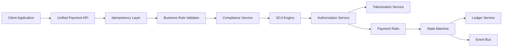

#### 1. High-Level Design

- **Summary:** This epic provides a unified payment acceptance API supporting multiple channels (online, payment link, terminal, invoice) with idempotent payment initiation, business-rule validation, compliance decisioning, PSD2 SCA with exemptions, authorization (full/partial), capture/void/partial capture, and refund processing. The system enforces a deterministic transaction state machine, records all financial movements as balanced double-entry ledger postings, tokenizes card data at the edge to minimize PCI scope, and ensures exactly-once processing guarantees for financial integrity.

- **Component Flow:**

- **Integration Points:**
  - **Upstream:** Enterprise IdP (authentication), compliance service (KYC/AML/risk decisions), tokenization service (PAN protection)
  - **Downstream:** Payment rails and scheme networks (authorization), ledger service (double-entry postings), event bus (state transitions), external card networks and acquirers

- **Key Assumptions:**
  - Idempotency key retention period is 24 hours; authorization timeout threshold is 30 seconds with automatic decline on timeout to prevent hung transactions.

- **NFR Highlights:** Authorization API p95 latency ≤300ms; exactly-once settlement posting with zero double-debit tolerance; PAN tokenized at edge per PCI DSS Req 3; AES-256 at rest, TLS 1.3 in transit; horizontal auto-scaling within 2 minutes at 2x peak; 99.9% availability; multi-AZ deployment; 100% end-to-end traceability.

- **Data Flow:** Client applications submit payment requests to the Unified Payment API, which passes them through the Idempotency Layer (using idempotency keys for safe retries). The Business Rule Validator checks merchant limits, currency support, and payment method eligibility. The Compliance Service performs KYC/AML/risk checks and returns approve/decline/refer decisions. For card payments requiring SCA, the SCA Engine evaluates PSD2 exemptions and triggers authentication flows. The Authorization Service tokenizes PANs via the Tokenization Service (edge tokenization), then routes authorization requests to Payment Rails and scheme networks. Authorization responses update the State Machine, which enforces deterministic transaction state transitions (authorized → captured → settled, or authorized → voided). Every state transition generates balanced double-entry postings to the Ledger Service and publishes audit events to the Event Bus. Capture, void, and refund operations follow the same flow with state validation. Deferred settlement scenarios are handled by the State Machine to prevent duplicate debits.

#### 2. Validation Report

- **Requirements Coverage:** The design comprehensively covers the epic's scope including unified payment initiation API with idempotency, multi-channel support (online, payment link, terminal, invoice), business-rule validation, compliance checks (KYC/AML/risk), PSD2 SCA with exemptions, authorization (full/partial), capture/void/partial capture, refund processing, deterministic state machine, append-only double-entry ledger, audit event generation, deferred settlement handling, and edge tokenization. All NFRs are addressed: p95 latency ≤300ms, exactly-once settlement, idempotency (24h retention), balanced ledger (hard invariant), PAN tokenization per PCI DSS, encryption (AES-256/TLS 1.3), horizontal auto-scaling (2 min at 2x peak), 99.9% availability, multi-AZ deployment, resilience patterns (timeout/retry/circuit-breaker), SAST/DAST/SCA with zero critical/high, and 100% traceability. Integration dependencies (IdP, compliance, payment rails, tokenization, ledger, event bus, card networks) are mapped. The architecture ensures zero revenue leakage through exactly-once guarantees and financial integrity through balanced ledger postings.