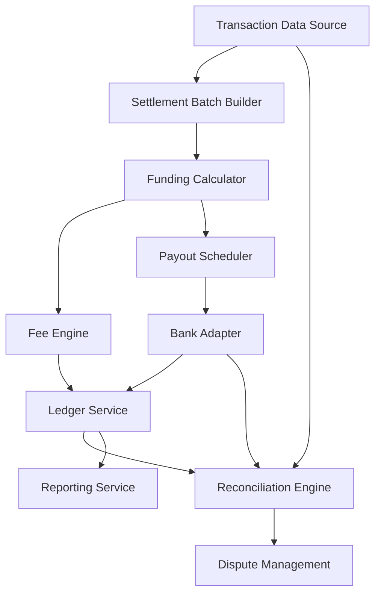

#### 1. High-Level Design

- **Summary:** This epic delivers an automated settlement and reconciliation platform that handles end-to-end financial operations from transaction settlement through merchant funding to bank payout execution. It includes fee calculation, three-way reconciliation (transaction-settlement-bank), dispute/chargeback management with scheme deadline tracking, and comprehensive financial reporting. The system ensures exactly-once settlement posting, 100% traceability, and ≥95% auto-reconciliation match rate.

- **Component Flow:**

- **Integration Points:**
  - **Upstream:** Payment rail adapters (settlement status), scheme networks (chargeback notifications)
  - **Downstream:** Ledger service (financial postings), bank adapters (payout instructions and statement ingestion), fee engine (per-transaction fee calculation), compliance service (CTR auto-generation), notification service (merchant/customer alerts)

- **Key Assumptions:**
  - Settlement batch windows are pre-configured per merchant contract (daily/weekly/custom); bank statement format follows standardized MT940 or equivalent with consistent field mapping.

- **NFR Highlights:** Exactly-once settlement and payout execution with zero double-debit tolerance; auto-reconciliation ≥95%; dispute SLA ≥99%; AES-256 encryption at rest, TLS 1.3 in transit; RBAC with tenant isolation; SOX §404 dual-control validation.

- **Data Flow:** Transaction data flows from payment rails into the Settlement Batch Builder, which groups transactions by merchant and settlement window. The Funding Calculator computes net merchant funding by applying fees (via Fee Engine) and reserve deductions, then posts balanced double-entry records to the Ledger Service. The Payout Scheduler generates payout instructions per merchant terms and sends them to Bank Adapters for execution. Bank statements are ingested and fed to the Reconciliation Engine, which performs three-way matching (transaction-settlement-bank credit). Exceptions are routed to break queues for investigation. Chargebacks from scheme networks enter Dispute Management for case tracking, evidence collection, and resolution with ledger adjustments. All financial data is queryable via the Reporting Service with tenant isolation.

#### 2. Validation Report

- **Requirements Coverage:** The design fully covers the epic's scope including settlement batch processing, funding calculations with fees/reserves, payout scheduling and execution, three-way reconciliation with ≥95% auto-match, dispute/chargeback management with deadline tracking, and comprehensive reporting. All NFRs are addressed: exactly-once processing, financial integrity (balanced ledger), encryption (AES-256/TLS 1.3), RBAC with tenant isolation, SOX dual-control, and immutable audit trails. Integration dependencies (ledger, bank adapters, payment rails, scheme networks, fee engine, compliance, notification service) are mapped to components. The architecture ensures 100% traceability and zero revenue leakage through deterministic state management and idempotent operations.