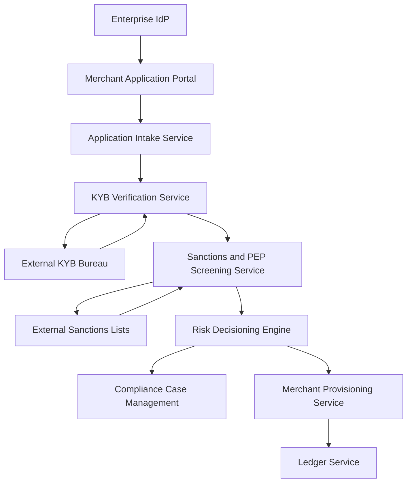

#### 1. High-Level Design

**Summary:** This epic enables prospective merchants to submit onboarding applications, undergo automated KYB (Know Your Business) verification, sanctions and PEP (Politically Exposed Persons) screening, risk decisioning with dual control, and merchant provisioning with MID (Merchant ID) issuance. The system captures business identity, ownership, and settlement bank details, verifies business legitimacy through external KYB bureaus, screens against sanctions/PEP lists, produces approve/decline/refer decisions, and provisions merchant records with ledger accounts, ensuring compliant, efficient merchant onboarding while maintaining regulatory adherence to GDPR, AMLD, CTF, and SOX requirements.

**Component Flow:**

**Integration Points:**
- **Upstream:** Enterprise IdP for authentication during application submission
- **Downstream:** Ledger service for account provisioning
- **External:** External KYB bureau for business verification, sanctions and PEP list providers, compliance service for case management

**Key Assumptions:**
- KYB bureau API responses map consistently to pass/refer/fail decisions; bureau availability SLA supports the 50% onboarding time reduction target.
- Dual-control approval workflow is implemented with segregation of duties; the second approver cannot be the same individual who initiated the decision.

**NFR Highlights:** Authentication via enterprise IdP using OIDC with JWT validation; TLS 1.3 for all data in transit; AES-256 encryption at rest; personal data handling per GDPR Art. 6 and 7 with documented legal basis; immutable audit events for all decisions; dual-control validation for approvals per SOX §404; sanctions screening results restricted to Risk/Compliance role; Privacy Impact Assessment required for PII handling.

**Data Flow:** Prospective merchants access the Application Portal, authenticated via Enterprise IdP using OIDC. The Application Intake Service captures business identity, ownership structure, beneficial owners, and settlement bank details, validating mandatory fields and persisting the application with documented GDPR legal basis and consent. The KYB Verification Service invokes the External KYB Bureau to verify business legitimacy, mapping bureau responses to pass/refer/fail decisions; failures or timeouts trigger retry logic with no silent failures. The Sanctions and PEP Screening Service screens the applicant and beneficial owners against External Sanctions Lists, producing clear/hit results; hits auto-hold the application and open a compliance case in the Compliance Case Management system. The Risk Decisioning Engine evaluates passed KYB and clear sanctions results to produce approve/decline/refer decisions; refer cases require dual-control human approval with segregation of duties per SOX §404. On approval, the Merchant Provisioning Service atomically creates the merchant record, issues a unique MID, and opens ledger accounts via the Ledger Service; partial provisioning failures trigger rollback. Immutable audit events are captured for all onboarding decisions, with sanctions screening results access-restricted to Risk/Compliance roles.

#### 2. Validation Report

**Requirements Coverage:** The design comprehensively covers all stated scope elements:
- Merchant application intake (FR-ONB-01)
- KYB verification via external bureau (FR-ONB-02)
- Sanctions and PEP screening (FR-ONB-03)
- Risk decisioning with dual control (FR-ONB-04)
- Merchant and MID provisioning (FR-ONB-05)
- Ledger account opening (integrated via Ledger Service)
- Compliance case management for sanctions hits (integrated via Compliance Case Management)
- Audit trail for all onboarding decisions (FR-LED-04)

The design satisfies all NFRs: authentication via enterprise IdP using OIDC with JWT validation, TLS 1.3 for data in transit, AES-256 encryption at rest, personal data handling per GDPR Art. 6 and 7 with documented legal basis, immutable audit events for all decisions, dual-control validation for approvals per SOX §404, sanctions screening results restricted to Risk/Compliance role, and Privacy Impact Assessment required for PII handling. All dependencies (External KYB bureau, sanctions and PEP list providers, enterprise IdP, ledger service, compliance service) are explicitly integrated. The design supports the success metric of reducing onboarding time by at least 50% compared to manual KYB processes through automation. Out-of-scope items (merchant portfolio management, merchant self-service configuration updates, merchant pricing negotiation workflows, automated merchant risk scoring models, third-party marketplace integrations) are correctly excluded.