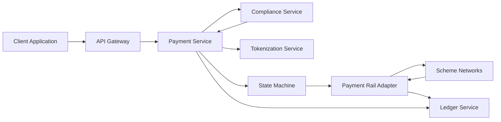

#### 1. High-Level Design

**Summary:** This epic delivers a unified payment acceptance API supporting multiple channels (online, payment link, terminal, invoice) with comprehensive transaction lifecycle management including authorization, capture, void, refund, and deterministic state transitions. The system enforces idempotent payment initiation, business-rule validation, compliance decisions before authorization, PSD2 SCA with exemptions, full and partial authorization with ledger holds, and maintains an append-only double-entry ledger for all financial movements, ensuring financial integrity and complete traceability.

**Component Flow:**

**Integration Points:**
- **Upstream:** Enterprise IdP for authentication, compliance service for KYC/AML/risk decisions, tokenization service for PAN protection
- **Downstream:** Payment rail adapters for card and A2A processing, scheme networks for authorization routing, ledger service for double-entry postings
- **External:** Card schemes and account-to-account rails for transaction authorization

**Key Assumptions:**
- Idempotency key retention is 24 hours (as proposed in NFR-FIN-02); clients are responsible for generating unique keys per payment initiation.
- Partial authorization is supported by the underlying payment rails; rail-specific capabilities are abstracted by the adapter layer.

**NFR Highlights:** Authorization API p95 latency target 300ms; exactly-once settlement posting with zero tolerance for double-debit; idempotency key retention 24 hours; ledger balanced on every posting with hard invariant; PAN tokenized at edge and never persisted downstream per PCI DSS Req 3; TLS 1.3 in transit and AES-256 at rest with separate keys; CVV/PIN never stored; transaction processing SLA 95% within 3 seconds; horizontal auto-scaling within 2 minutes at 2x peak; multi-AZ deployment mandatory; resilience patterns on all external calls; 24/7/365 availability target 99.9%.

**Data Flow:** Client applications submit payment initiation requests to the API Gateway with an idempotency key. The Payment Service validates the request schema, checks idempotency (returning cached results for duplicate keys), and tokenizes PAN data at the edge via the Tokenization Service. Business-rule validation (payer/payee presence, amount > 0, currency/rail support) is performed. The Compliance Service is invoked for KYC/AML/risk decisions; failures block further processing. For EEA/UK customer-initiated payments, PSD2 SCA is enforced with exemption logic applied. The Payment Service transitions the payment through the State Machine, which enforces legal state transitions. Authorization requests flow through the Payment Rail Adapter to Scheme Networks; full or partial authorization results are received. The Ledger Service records all financial movements as balanced, immutable double-entry postings (holds on authorization, captures, voids, refunds as compensating entries). Subsequent lifecycle operations (capture, void, refund) follow the same pattern: state machine validation, rail adapter interaction, and ledger posting. Immutable audit events are captured for every state transition.

#### 2. Validation Report

**Requirements Coverage:** The design comprehensively covers all stated scope elements:
- Unified payment initiation API with idempotency (FR-PAY-01)
- Business-rule validation (FR-PAY-02)
- KYC/AML/risk compliance checks (FR-PAY-03)
- PSD2 SCA enforcement with exemptions (FR-PAY-04)
- Authorization with full and partial support (FR-PAY-05)
- Capture and void operations (FR-PAY-06)
- Refund processing (FR-PAY-07)
- Deterministic transaction state machine (FR-LED-01)
- Append-only double-entry ledger (FR-LED-02)
- Immutable audit events for all transitions (FR-LED-04)
- Deferred settlement handling (FR-LED-05)
- PAN tokenization at edge (integrated via Tokenization Service)

The design satisfies all NFRs: authorization p95 latency 300ms, exactly-once settlement with zero double-debit tolerance, 24-hour idempotency key retention, balanced ledger hard invariant, PAN tokenized at edge per PCI DSS Req 3, TLS 1.3 in transit and AES-256 at rest, CVV/PIN never stored, transaction processing SLA 95% within 3 seconds, horizontal auto-scaling within 2 minutes at 2x peak, multi-AZ deployment, resilience patterns on all external calls, and 99.9% availability target. All dependencies (Enterprise IdP, compliance service, payment rail adapters, scheme networks, ledger service, tokenization service) are explicitly integrated. Out-of-scope items (issuing and card production, lending and BNPL products, cross-border FX optimization, autonomous agentic operations, real-time fraud scoring beyond compliance service, installment payment plans) are correctly excluded.