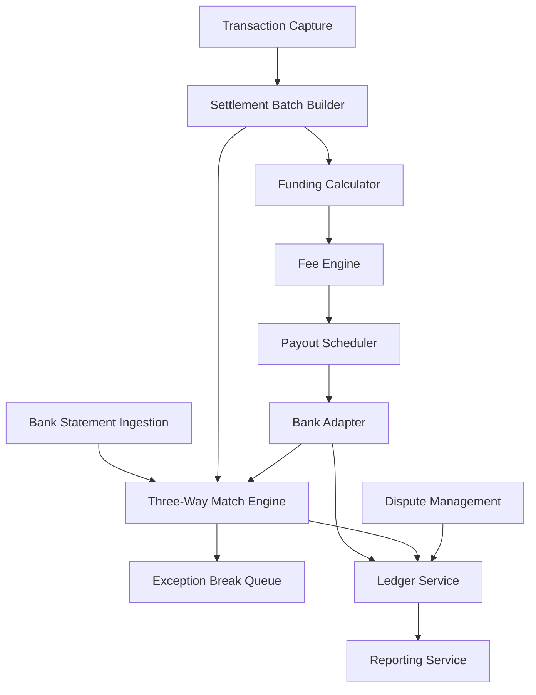

#### 1. High-Level Design

**Summary:** This epic delivers end-to-end settlement and financial operations capabilities, encompassing settlement batch processing, merchant funding calculations, payout scheduling and execution, fee computation with transparency, three-way reconciliation (transaction-settlement-bank credit), dispute and chargeback management, and comprehensive reporting. The system ensures 100% payout traceability with automated reconciliation achieving 95%+ auto-match rate, reduces manual reconciliation effort, ensures 99%+ dispute SLA adherence, and provides complete fee transparency to merchants.

**Component Flow:**

**Integration Points:**
- **Upstream:** Ledger service for all financial postings, fee engine for rate calculation
- **Downstream:** Bank adapter for payout instruction and statement ingestion, scheme networks for chargeback notifications and representment submission
- **External:** Merchant bank accounts for settlement, operations console for break and dispute management

**Key Assumptions:**
- Bank statement formats are standardized or normalizable with known schemas; statement ingestion frequency is daily or as per bank delivery schedule.
- Tolerance thresholds for three-way matching (rounding/FX) are configurable and defined per merchant agreement.

**NFR Highlights:** Exactly-once settlement posting with zero tolerance; dual-control validation for funding calculations per SOX §404; balanced ledger on every posting; bank payout execution with exactly-once guarantee; auto-match rate target 95% or higher; reporting query response time per enterprise baseline; transaction search results scoped to merchant's own MID with cross-tenant access blocked; immutable audit trail for all break resolutions and dispute decisions; WCAG 2.1 AA compliance for UI surfaces; data residency per contract requirements.

**Data Flow:** Eligible captured transactions flow into the Settlement Batch Builder, which groups them by window and merchant. The Funding Calculator computes net merchant funding (gross minus fees and reserves) by invoking the Fee Engine. The Payout Scheduler creates payout instructions per merchant terms, which the Bank Adapter executes with exactly-once guarantees, posting to the Ledger Service. Concurrently, Bank Statement Ingestion normalizes incoming bank credits. The Three-Way Match Engine correlates transaction records, settlement batches, and bank credits; matched sets are cleared, while exceptions route to the Break Queue for manual investigation. Dispute cases are created from scheme chargeback notifications, tracked with deadline escalation, and resolved with ledger adjustments. All financial movements post to the immutable Ledger, and the Reporting Service provides settlement, fee, and transaction reports with full traceability.

#### 2. Validation Report

**Requirements Coverage:** The design comprehensively covers all stated scope elements:
- Settlement batch processing (FR-SET-01)
- Merchant funding calculation with fee and reserve deduction (FR-SET-02, FR-FEE-02)
- Payout scheduling per merchant terms (FR-SET-03)
- Bank payout execution with status tracking (FR-SET-04)
- Fee schedule configuration with versioning (FR-FEE-01)
- Fee transparency breakdown (FR-FEE-03)
- Bank statement ingestion and normalization (FR-REC-01)
- Three-way match engine with tolerance handling (FR-REC-02)
- Exception break queue with reason codes (FR-REC-03)
- Break investigation and resolution with audit (FR-REC-04)
- Chargeback intake from scheme notifications (FR-DIS-01)
- Dispute case management with deadline tracking (FR-DIS-02)
- Evidence collection and representment submission (FR-DIS-03)
- Dispute resolution with ledger adjustments (FR-DIS-04)
- Settlement, fee, and transaction reports (FR-REP-01, FR-REP-02, FR-REP-03)
- Data export capabilities (FR-REP-04)

The design satisfies all NFRs: exactly-once settlement posting, dual-control validation, balanced ledger invariant, bank payout exactly-once guarantee, no silent data loss, 95%+ auto-match target, enterprise baseline query response, merchant-scoped transaction search with cross-tenant blocking, immutable audit trail, WCAG 2.1 AA compliance, and data residency per contract. All dependencies (Ledger service, bank adapter, fee engine, scheme networks, merchant bank accounts, operations console) are explicitly integrated. Out-of-scope items (cross-border FX optimization, dynamic currency conversion, merchant lending, AI-driven dispute evidence, third-party reconciliation tools, real-time settlement for all rails, merchant self-service dispute submission) are correctly excluded.