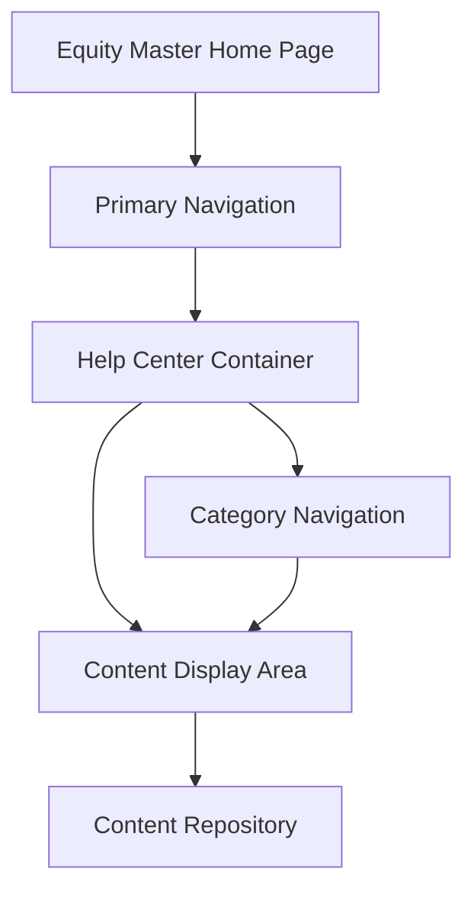

#### 1. High-Level Design

- **Summary**: This epic enables users to access a centralized Help Center from the Equity Master Home Page primary navigation, providing seven categorized support sections (Getting Started, FAQs, How-to Guides, Video Tutorials, Help Materials, Troubleshooting, Chat Support) with dynamic content display, search functionality, and responsive design using existing application patterns.

- **Component Flow**:

- **Integration Points**: 
  - Existing Equity Master Home Page codebase and styling
  - Shared style components and layout patterns
  - Video hosting and embedding capability
  - Downloadable materials storage and access infrastructure

- **Key Assumptions**: 
  - Primary navigation has available space or extensibility to add Help Center link without breaking existing layout
  - Getting Started content is pre-configured as the default view when Help Center is first accessed

- **NFR Highlights**: Content and navigation must load within 2 seconds on standard broadband; Must support 10,000 concurrent users; Must maintain 99.9% uptime; Must meet WCAG 2.1 AA accessibility standards

- **Data Flow**: User clicks Help Center link in Primary Navigation → Help Center Container loads → Category Navigation displays seven categories → Getting Started content loads by default from Content Repository into Content Display Area within 2 seconds. User selects different category → Content Display Area dynamically updates with selected category content from repository while maintaining responsive design across devices.

#### 2. Validation Report

- **Requirements Coverage**: The design fully addresses the epic's scope including primary navigation integration, seven categorized help sections, category selection with dynamic content display, Getting Started default view, responsive design, and preservation of existing Equity Master features. All NFRs are covered: 2-second load time, 10,000 concurrent user support, 99.9% uptime target, and WCAG 2.1 AA accessibility compliance through keyboard navigation and ARIA labels.