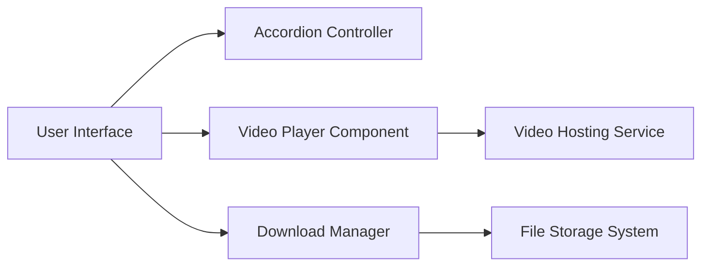

#### 1. High-Level Design

- **Summary**: This epic delivers interactive help content features including expandable/collapsible accordions for FAQs, How-to Guides, and Troubleshooting sections, embedded video tutorial playback within the Help Center, and downloadable Help Materials with file metadata. Implementation includes graceful error handling for unavailable resources and accessibility compliance.

- **Component Flow**:

- **Integration Points**: 
  - Video hosting service for embedded playback
  - File storage system for downloadable materials
  - Existing accordion UI components and patterns
  - ARIA-compliant interactive controls for accessibility

- **Key Assumptions**: 
  - Video content is already hosted and accessible via embed URLs with appropriate CORS configuration
  - File metadata (type, size) is stored alongside downloadable materials in the file storage system

- **NFR Highlights**: Accordion interactions must respond within 200ms; All interactive elements must be keyboard accessible; Downloadable materials must not expose sensitive data; Video players must be responsive

- **Data Flow**: User clicks accordion control → Accordion Controller toggles expand/collapse state within 200ms → Content rendered in UI. For videos: User selects video tutorial → Video Player Component loads embed from Video Hosting Service → Video plays within Help Center. For downloads: User requests material → Download Manager retrieves file metadata from File Storage System → File downloaded with type and size information displayed.

#### 2. Validation Report

- **Requirements Coverage**: The design comprehensively covers all stated requirements including expandable/collapsible accordions with circular controls, embedded video players, downloadable materials with metadata, unavailable resource messaging, and keyboard/screen reader accessibility. All NFRs are addressed: 200ms accordion response time, keyboard accessibility, data security for downloads, and responsive video playback within the Help Center.