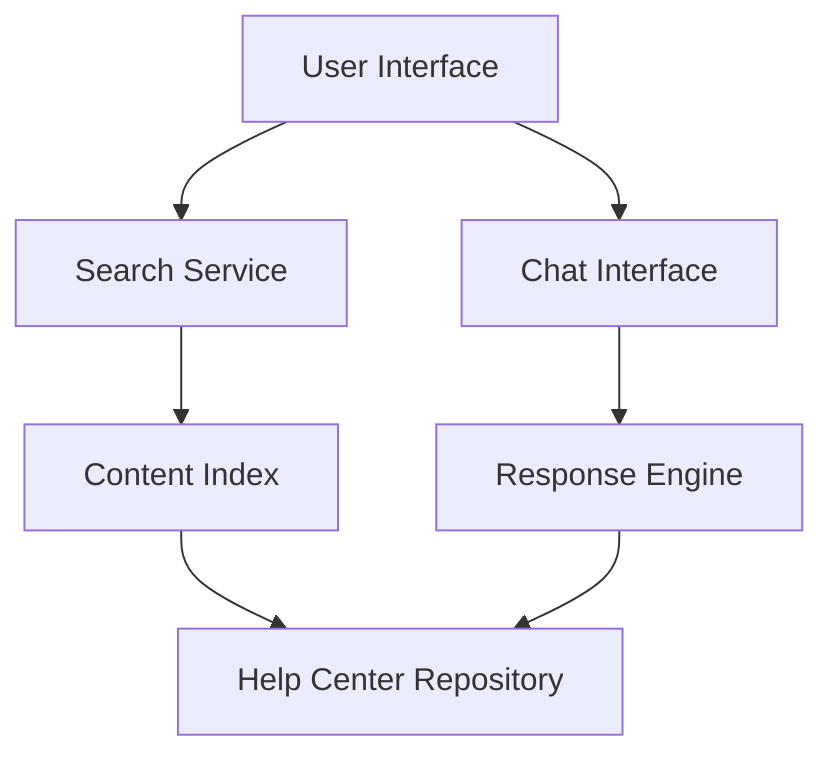

#### 1. High-Level Design

- **Summary**: This epic implements comprehensive keyword search functionality across all Help Center content categories and resources, with validation for empty searches and no-result scenarios. It also delivers an interactive chat support feature using predefined responses and existing UI patterns, providing immediate user guidance without external AI integration.

- **Component Flow**:

- **Integration Points**: 
  - Existing Help Center content repository for search indexing
  - Predefined chat response database or configuration
  - Existing UI components for chat interface
  - Search indexing service or library

- **Key Assumptions**: 
  - Search indexing will be performed asynchronously and kept up-to-date with content changes
  - Predefined chat responses are maintained in a structured configuration file or database table

- **NFR Highlights**: Search results must return within 2 seconds; Chat responses must be delivered within 1 second; Must index all Help Center categories and resources

- **Data Flow**: User enters search keywords → Search Service queries Content Index → Index retrieves matching content from Help Center Repository → Results displayed in UI within 2 seconds. For chat: User submits question via Chat Interface → Response Engine matches question to predefined responses from repository → Response delivered to user within 1 second with chat history maintained during session.

#### 2. Validation Report

- **Requirements Coverage**: The design fully covers the epic's stated scope including keyword search across all content, empty search validation, no-result handling, interactive chat interface, predefined response delivery, and chat history display. All NFRs for performance (2-second search, 1-second chat response) and scope limitations (no external AI, predefined responses only) are addressed through the component architecture.