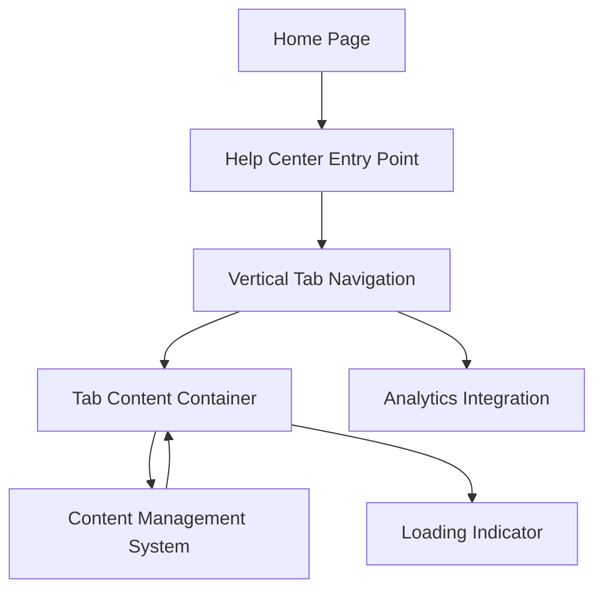

#### 1. High-Level Design

- **Summary**: This epic establishes the foundational Help Center infrastructure on the Home Page, including a visually prominent entry point and vertical tab navigation system with six organized tabs (FAQs, How-to Guides, Video Tutorials, Help Materials, Troubleshooting, Chat Support). The implementation ensures responsive design across desktop and mobile devices.

- **Component Flow**:

- **Integration Points**: 
  - Website analytics integration for tracking metrics
  - Existing Home Page layout and infrastructure
  - Content management system for help resources

- **Key Assumptions**: 
  - Home Page infrastructure supports embedding of new Help Center component
  - Content Management System provides API or data layer for tab content retrieval

- **NFR Highlights**: Help Center and all tabs must load within 2 seconds on standard broadband; Support up to 10,000 concurrent users; 99.9% uptime with fallback messaging; WCAG 2.1 AA accessibility including keyboard navigation and screen reader support; Mobile accessibility score of 90%+

- **Data Flow**: User lands on Home Page → Help Center Entry Point is rendered prominently → User clicks entry point or navigates to Help Center → Vertical Tab Navigation loads with six tabs → User selects a tab → Tab Content Container retrieves content from Content Management System → Loading indicator displays if content takes >1 second → Content rendered in responsive layout → Context retained when switching tabs → All interactions tracked via Analytics Integration → Fallback messaging displayed if content unavailable

#### 2. Validation Report

- **Requirements Coverage**: The design covers all foundational requirements including Help Center entry point on Home Page, vertical tab navigation system with six tabs, tab switching functionality, context retention between tabs, mobile responsive design, loading indicators for delayed content, fallback messaging for unavailable content, performance requirements (2-second load time, 10,000 concurrent users), uptime (99.9%), and comprehensive accessibility standards (WCAG 2.1 AA, keyboard navigation, screen reader support, 90%+ mobile accessibility score).