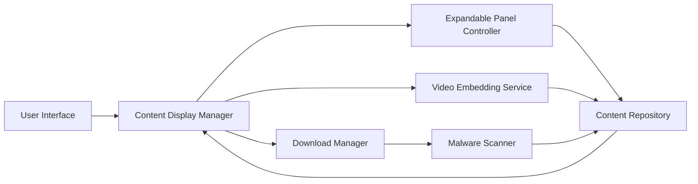

#### 1. High-Level Design

- **Summary**: This epic delivers interactive, expandable help content across FAQs, How-to Guides, and Troubleshooting tabs, with embedded Video Tutorials and downloadable Help Materials. Users can expand/collapse panels using +/- controls, watch videos, and download resources with proper error handling for broken links.

- **Component Flow**:

- **Integration Points**: 
  - Content team for accurate and up-to-date help content
  - Stakeholders for video links and downloadable materials
  - Malware scanning service for downloadable resources

- **Key Assumptions**: 
  - Content is stored in a structured format supporting expandable/collapsible rendering
  - Video links point to approved hosting platforms with embed support

- **NFR Highlights**: Expandable panels display loading indicator if content retrieval exceeds 1 second; Video embedding handles broken links gracefully; Downloadable materials scanned for malware; WCAG 2.1 AA accessibility compliance

- **Data Flow**: User navigates to FAQ/How-to/Troubleshooting tab → Content Display Manager retrieves content from Content Repository → Expandable Panel Controller renders +/- controls → User clicks to expand panel → Detailed content displayed (with loading indicator if >1 second) → For videos, Video Embedding Service validates links and displays thumbnails or error messages → For downloads, Download Manager triggers malware scan before serving file → All content meets accessibility standards

#### 2. Validation Report

- **Requirements Coverage**: The design addresses all requirements including expandable FAQ/How-to/Troubleshooting panels with +/- controls, embedded Video Tutorials with placeholder thumbnails, downloadable Help Materials tiles, error messaging for broken links, minimum content thresholds (5 questions per tab, 3 video links, 2 downloadable resources), loading indicators, malware scanning, and accessibility standards.