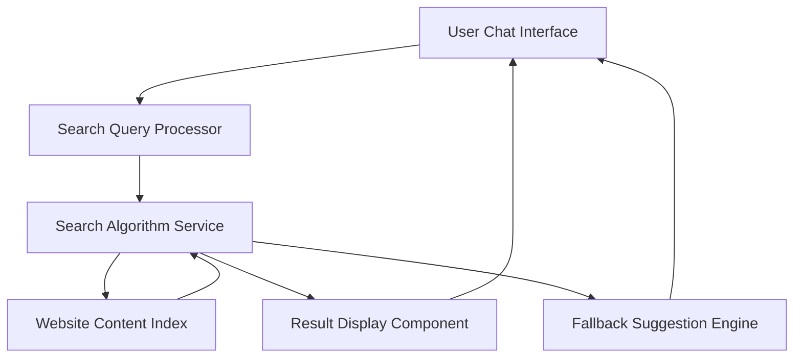

#### 1. High-Level Design

- **Summary**: This epic implements an intelligent Chat Support tab with a searchable help assistant that queries website content to provide instant, relevant answers within 2 seconds. The system includes fallback suggestions when no results are found and maintains security by not exposing personal user data.

- **Component Flow**:

- **Integration Points**: 
  - Website content index for search functionality
  - Website analytics for tracking Chat Support engagement
  - Search algorithm or service for content retrieval

- **Key Assumptions**: 
  - Website content is pre-indexed and maintained in a searchable format
  - Search algorithm supports keyword and semantic matching for relevant results

- **NFR Highlights**: Search results must be returned within 2 seconds; System must support up to 10,000 concurrent users; 99.9% uptime; WCAG 2.1 AA accessibility; No exposure of user personal data

- **Data Flow**: User enters search query in Chat Support interface → Query is processed and sent to Search Algorithm Service → Service queries Website Content Index → Relevant results are retrieved and ranked → Results displayed to user within 2 seconds → If no results found, Fallback Suggestion Engine provides helpful alternative suggestions → All interactions logged to Website Analytics

#### 2. Validation Report

- **Requirements Coverage**: The design covers all stated requirements including the Chat Support tab interface, website content search functionality, 2-second response time, fallback suggestions, search query processing, and conversational interface. Security requirements for data privacy are addressed through isolated search operations. Performance and accessibility NFRs are incorporated into the architecture.