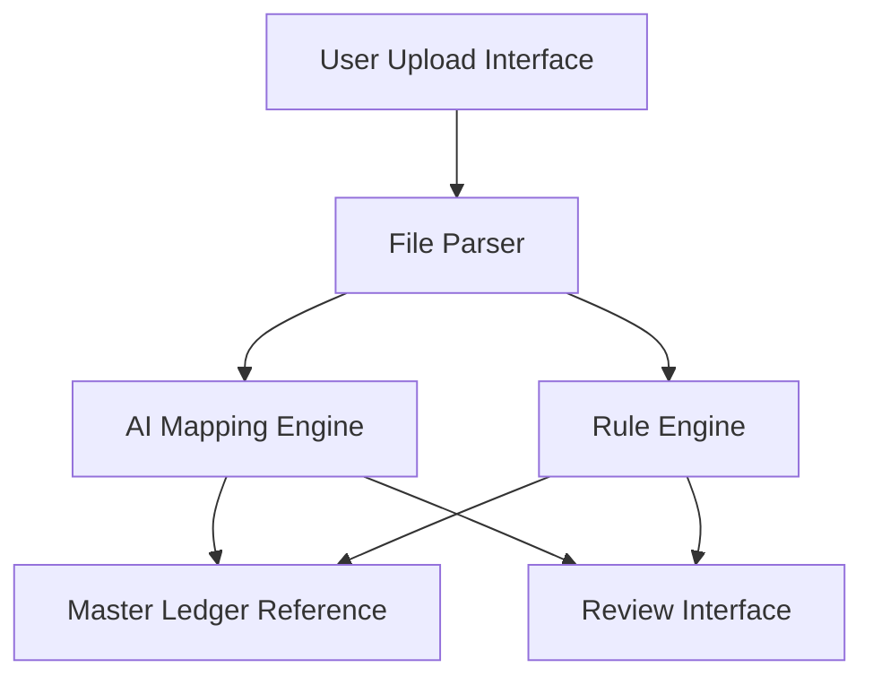

#### 1. High-Level Design

- **Summary**: This epic enables automated mapping of legacy bookkeeping accounts to Azets master ledger using AI and rule-based algorithms. Users upload legacy account structures in multiple formats (CSV/XLSX/XML), receive intelligent mapping suggestions, and manually override ambiguous cases. The system flags uncertain mappings for review, reducing integration errors from 15% to under 2% and accelerating integration timelines from 2-4 weeks to under 3 days.

- **Component Flow**:

- **Integration Points**: 
  - Cozone platform API for ledger updates
  - Historical mapping data for AI model training
  - User-Service for access controls and authentication

- **Key Assumptions**: 
  - Legacy account structures follow standard accounting nomenclature allowing pattern recognition
  - AI model is pre-trained on historical mapping data and continuously improves with user feedback

- **NFR Highlights**: Mapping operations within 60 seconds for up to 10,000 accounts; support for 100 concurrent sessions; process up to 1 million accounts per month; TLS 1.2+ and AES-256 encryption; GDPR compliance; 99.9% uptime with automated failover

- **Data Flow**: Users upload legacy account structures through the Upload Interface. The File Parser validates and extracts account data from CSV/XLSX/XML formats. Both the AI Mapping Engine and Rule Engine process the accounts in parallel, comparing them against the Master Ledger Reference to generate mapping suggestions. High-confidence mappings are auto-approved, while ambiguous mappings are flagged and routed to the Review Interface for manual override. Users can view mapping history, download results, and receive error notifications for failed mappings. Approved mappings are then passed to the Cozone Integration Service for ledger updates.

#### 2. Validation Report

- **Requirements Coverage**: The design covers all stated requirements including legacy account structure upload in multiple formats, AI-driven mapping suggestions, rule-based algorithms, ambiguous mapping flagging, manual override capability, bulk mapping for multiple firms, error notifications, and mapping history view/download. The architecture supports the NFRs for mapping speed (60 seconds for 10,000 accounts), concurrent sessions (100), monthly volume (1 million accounts), encryption (TLS 1.2+ and AES-256), GDPR compliance, and uptime (99.9%). Integration with Cozone platform API, historical mapping data, and User-Service is accounted for in the component flow.